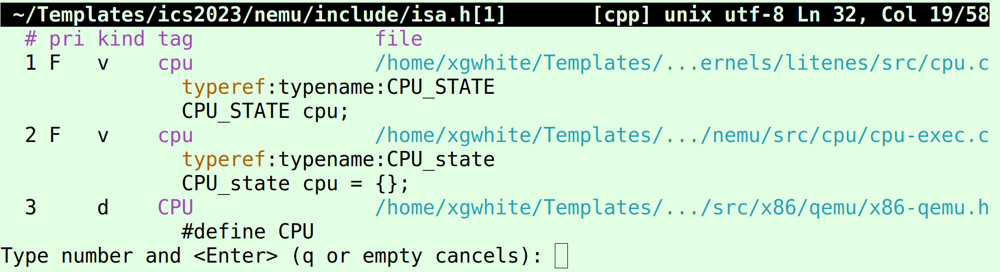
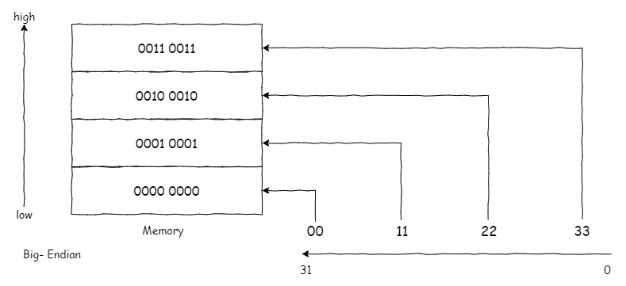
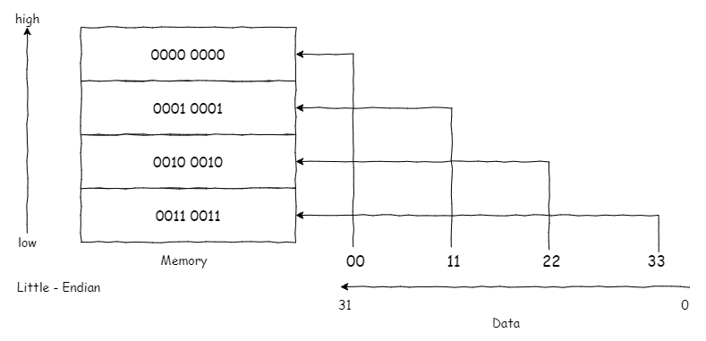
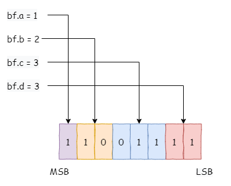
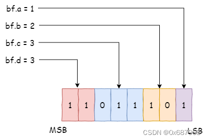

# PA1-最简单的计算机

## 1.1 开天辟地的篇章

### 最简单的计算机

存储器：足够大容量的不见，放下各种各样的程序

CPU：中央处理器，负责处理数据的核心电路单元，负责计算

CPU有运算器，可以处理数据

寄存器：让CPU把正在处理中的数据暂时存放在其中指令：用来指示CPU对数据进行各种处理，可以通过指令控制CPU

当执行完一条指令，就继续执行下一条指令

CPU如何指导现在执行到哪一条指令？通过程序计数器PC （ Program Counter ）

```c
while (1) {
  从PC指示的存储器位置取出指令;
  执行指令;
  更新PC;
}
```

图灵机 TRM，Turing Machine， 存储器，PC，寄存器，加法器

作为一个最简单的真实计算机需要满足哪些条件:

- 结构上，TRM有存储器，PC，寄存器，加法器
- 工作方式上，TRM不断地重复以下过程：从PC指示的存储器位置取出指令，执行指令，然后更新PC

### 计算机是个状态机

计算机是一个数组逻辑电路，可以划分为两部分：

1. 一部分由所有时序逻辑部件（存储器，计数器，寄存器）构成
2. 另一部分则是剩余的组合逻辑部件（如，加法器，等）

从状态机模型的视角来理解计算机的工作过程：

在每个时钟周期到来的时候，计算机根据当前时序逻辑部件的状态，在组合逻辑部件的作用下，计算并转移到下一个时钟周期的新状态

给定一个程序，把它放入计算机内存中，相当于，在状态数量为$N$的状态转移图中，制定了一个初始状态，程序运行的过程就是从这个初始状态开始，每执行完一条指令，就会进行一次确定的状态转移。也就是说，程序也可以看成一个状态机，是上述大状态机的子集

## 1.2 框架代码

### 框架代码初探

NEMU构成：monitor, CPU, memory, 设备

Monitor 监视器，监视客户计算机的运行状态，负责与Linux交互，带有调试器功能

### 项目构建和Makefile

NEMU的Makefile具备如下功能：

- 与配置系统进行关联
  - 通过包含`nemu/include/config/auto.conf`，与kconfig生成的变量进行关联，故，在通过menuconfig更新配置选项沟，Makefile的行为可能也会有所变化
  
- 文件列表 filelist

  - 决定最终参与编译的源文件

- 编译和链接

  - Makefile的编译规则在 `nemu/scripts/build.mk`中定义

    
  

看不懂：

于是你就可以根据上述输出结果和Makefile反推`$(CFLAGS)`的值是如何形成的. 因为编译每个文件的命令都很类似, 当你理解了一个源文件的编译之后, 你就能类推到其它源文件的编译过程了. 同理, 你也可以按照上述方法理解最后的链接命令.

#PA1 问题解决

## 解决q会Error 1的问题

探索问题，解决如下报错信息：

```makefile
(nemu) q
make: *** [/home/xgwhite/Templates/ics2023/nemu/scripts/native.mk:38: run] Error 1
```

先查一查`make`的出现该错误的含义：

> 这些错误并不是真的make的错误。它们意味着make调用的程序返回非零状态值，错误码（Error NN），这种情况make解释为失败，或非正常方式退出（一些类型信号）

**所以问题在于：键入`q`后，`main`程序结束时返回值不为0**

程序执行，从`main`开始，由`main`结束。

所以先分析一下`main`函数

```C
 23 int main(int argc, char *argv[]) {
 24   /* Initialize the monitor. */
 25 #ifdef CONFIG_TARGET_AM
 26   am_init_monitor();
 27 #else
 28   init_monitor(argc, argv);
 29 #endif
 30 
 31   /* Start engine. */
 32   engine_start();
 33 
 34   return is_exit_status_bad();
 35 }       
```

它会[初始化Monitor](#初始化Monitor会做什么？)（这个模块负责交互、调试器），并开始engine。

```c
 20 void engine_start() {
 21 #ifdef CONFIG_TARGET_AM
 22   cpu_exec(-1);
 23 #else
 24   /* Receive commands from user. */
 25   sdb_mainloop();
 26 #endif
 27 }    
```

会执行`sdb_mainloop()`函数

```c
99 void sdb_mainloop() {
    105   for (char *str; (str = rl_gets()) != NULL; ) {

125     int i;
126     for (i = 0; i < NR_CMD; i ++) {
127       if (strcmp(cmd, cmd_table[i].name) == 0) {
128         if (cmd_table[i].handler(args) < 0) { return; }
129         break;
130       }
131     }
132 
               
134   }
135 }
```

其中`str = rl_gets())`会获取输入的内容

```c
 28 static char* rl_gets() {
 29   static char *line_read = NULL;

 36   line_read = readline("(nemu) ");
 
 42   return line_read;
 43 }
```

如果输入`q`，根据`cmd_table []` ：

```C
 57 static struct {
 58   const char *name;
 59   const char *description;
 60   int (*handler) (char *);
 61 } cmd_table [] = {

 64   { "q", "Exit NEMU", cmd_q },

 68 };
```

`cmd_q`函数为：

```c
 51 static int cmd_q(char *args) {
 52   return -1;
 53 }
```

`sdb_mainloop()`函数会执行`if (cmd_table[i].handler(args) < 0) { return; }`，即直接退出。

回顾一下函数之间的关系

```C
 23 int main(int argc, char *argv[]) {

 31   /* Start engine. */
 32   engine_start();
 33 
 34   return is_exit_status_bad();
 35 }       
```

```c
 20 void engine_start() {
 25   sdb_mainloop();
 27 }    
```

故而，`engine_start() `也会结束，回到`main`函数中，`main`函数继续执行下一行语句`return is_exit_status_bad()`

```c
 18 NEMUState nemu_state = { .state = NEMU_STOP };         
 19 
 20 int is_exit_status_bad() {
 21   int good = (nemu_state.state == NEMU_END && nemu_state.halt_ret == 0) ||
 22     (nemu_state.state == NEMU_QUIT);
 23   return !good;
 24 }    
```

其中，`nemu_state`是一个全局变量：

```c
 23 enum { NEMU_RUNNING, NEMU_STOP, NEMU_END, NEMU_ABORT, NEMU_QUIT };
 24 
 25 typedef struct {
 26   int state;
 27   vaddr_t halt_pc;
 28   uint32_t halt_ret;
 29 } NEMUState;
 30 
 31 extern NEMUState nemu_state; 
```

所以，键入`q`后，应该在某个位置把`nemu_state`改为`NEMU_QUIT`

```c
 51 static int cmd_q(char *args) {
 52   nemu_state.state=NEMU_QUIT;
 53   return -1;
 54 }
```

这时`is_exit_status_bad()`函数中，`good`值`!0`，`!good=0`，`is_exit_status_bad()`函数返回0，`main`函数执行`return 0;`，程序正常结束。

正常啦！哈哈哈

## 理解cpu_exec(-1)

前面漏掉的一个问题，因为前面实在没看懂，直到理清除`q`的问题才懂了一点点

> 在`cmd_c()`函数中, 调用`cpu_exec()`的时候传入了参数`-1`, 你知道这是什么意思吗?

```C
 45 static int cmd_c(char *args) {
 46   cpu_exec(-1);                                         
 47   return 0;
 48 }
```

根据讲义，

> 在命令提示符后键入`c`后, NEMU开始进入指令执行的主循环`cpu_exec()` . `cpu_exec()`又会调用`execute()`, 后者模拟了CPU的工作方式: 不断执行指令. 具体地, 代码将在一个for循环中不断调用`exec_once()`函数, 这个函数的功能就是我们在上一小节中介绍的内容: 让CPU执行当前PC指向的一条指令, 然后更新PC.

进入`cpu_exec()`函数去看看，逐段分析`cpu_exec(-1)`

第一段：

```C
99 /* Simulate how the CPU works. */                                 
100 void cpu_exec(uint64_t n) {
101   g_print_step = (n < MAX_INST_TO_PRINT);
102   switch (nemu_state.state) {
103     case NEMU_END: case NEMU_ABORT:
104       printf("Program execution has ended. To restart the program, exit NEMU and run again.\n");
105       return;
106     default: nemu_state.state = NEMU_RUNNING;
107   }
108                                                       
```

上方片段：`nemu_state.state`为`NEMU_END`、`NEMU_ABORT`时，直接退出该函数。不为`NEMU_END`、`NEMU_ABORT`时，将状态改为`NEMU_RUNNING`。

`uint64_t`其实就是`unsigned long int`，在某处应该有定义

```c
typedef unsigned long int       uint64_t; 
```

这样做有些好处，方便代码维护。

注意`unsigned`，那说明-1不是-1，而是？在函数中添加代码输出一下看看：

```C
100 void cpu_exec(uint64_t n) {
101  printf("调用函数cpu_exec(%lu)\n",n); 
102  g_print_step = (n < MAX_INST_TO_PRINT);
...
```

```C
调用函数cpu_exec(18446744073709551615)
```

故`n=18446744073709551615`，对应64位都1的二进制数，即-1对应无符号整数最大值

`static bool g_print_step = false; ` ，`g_print_step`默认值为`false`

根据` #define MAX_INST_TO_PRINT 10  `，故 `(n < MAX_INST_TO_PRINT)`结果为`false`，`g_print_step=0`；

第二段：

```C
109   uint64_t timer_start = get_time();
110 
111   execute(n);
112 
113   uint64_t timer_end = get_time();
114   g_timer += timer_end - timer_start;  
```

这一段主要是进入了一个函数，看看`execute(-1)`会做什么：

```c
 74 static void execute(uint64_t n) {                     
 75   Decode s;
 76   for (;n > 0; n --) {
 77     exec_once(&s, cpu.pc);
 78     g_nr_guest_inst ++;
 79     trace_and_difftest(&s, cpu.pc);
 80     if (nemu_state.state != NEMU_RUNNING) break;
 81     IFDEF(CONFIG_DEVICE, device_update());
 82   }
 83 }
```

```c
 43 static void exec_once(Decode *s, vaddr_t pc) {         
 44   s->pc = pc;
 45   s->snpc = pc;
 46   isa_exec_once(s);
 47   cpu.pc = s->dnpc;
 48 #ifdef CONFIG_ITRACE
 49   char *p = s->logbuf;                                 
 50   p += snprintf(p, sizeof(s->logbuf), FMT_WORD ":", s->pc);
 51   int ilen = s->snpc - s->pc;
 52   int i;
 53   uint8_t *inst = (uint8_t *)&s->isa.inst.val;
 54   for (i = ilen - 1; i >= 0; i --) {
 55     p += snprintf(p, 4, " %02x", inst[i]);
 56   }
 57   int ilen_max = MUXDEF(CONFIG_ISA_x86, 8, 4);
 58   int space_len = ilen_max - ilen;                     
 59   if (space_len < 0) space_len = 0;
 60   space_len = space_len * 3 + 1;
 61   memset(p, ' ', space_len);
 62   p += space_len;
 63 
 64 #ifndef CONFIG_ISA_loongarch32r
 65   void disassemble(char *str, int size, uint64_t pc, uint8_t *code, int nbyte)    ;
 66   disassemble(p, s->logbuf + sizeof(s->logbuf) - p,
 67       MUXDEF(CONFIG_ISA_x86, s->snpc, s->pc), (uint8_t *)&s->isa.inst.val, ile    n);
 68 #else
 69   p[0] = '\0'; // the upstream llvm does not support loongarch32r
 70 #endif
 71 #endif
 72 }
```

```c
 35 static void trace_and_difftest(Decode *_this, vaddr_t dnpc) {
 36 #ifdef CONFIG_ITRACE_COND
 37   if (ITRACE_COND) { log_write("%s\n", _this->logbuf); }
 38 #endif
 39   if (g_print_step) { IFDEF(CONFIG_ITRACE, puts(_this->logbuf)); }
 40   IFDEF(CONFIG_DIFFTEST, difftest_step(_this->pc, dnpc));
 41 }    
```

在第一段中分析了g_print_step为0，故`if (g_print_step) { }`不会执行。

device_update中有一段代码改变了状态

第三段：

```C
116   switch (nemu_state.state) {
117     case NEMU_RUNNING: nemu_state.state = NEMU_STOP; break;
118 
119     case NEMU_END: case NEMU_ABORT:
120       Log("nemu: %s at pc = " FMT_WORD,
121           (nemu_state.state == NEMU_ABORT ? ANSI_FMT("ABORT", ANSI_FG_RED) :
122            (nemu_state.halt_ret == 0 ? ANSI_FMT("HIT GOOD TRAP", ANSI_FG_GREEN    ) :
123             ANSI_FMT("HIT BAD TRAP", ANSI_FG_RED))),
124           nemu_state.halt_pc);
125       // fall through
126     case NEMU_QUIT: statistic();          
118 
119     case NEMU_END: case NEMU_ABORT:
120       Log("nemu: %s at pc = " FMT_WORD,
121           (nemu_state.state == NEMU_ABORT ? ANSI_FMT("ABORT", ANSI_FG_RED) :
122            (nemu_state.halt_ret == 0 ? ANSI_FMT("HIT GOOD TRAP", ANSI_FG_GREEN    ) :
123             ANSI_FMT("HIT BAD TRAP", ANSI_FG_RED))),
124           nemu_state.halt_pc);
125       // fall through
126     case NEMU_QUIT: statistic();   
127   }
128 } 
```

没完全看懂，但猜测会一支循环，循环终止条件不是n，而是当前待执行的命令（PC），此处为4步。

```makefile
(nemu) c
n>0;调用函数cpu_exec(18446744073709551615)
g_print_step=0
执行for,n=18446744073709551615;   执行for,n=18446744073709551614;   执行for,n=18446744073709551613;   执行for,n=18446744073709551612;   退出execute函数返回cpu_exec[src/cpu/cpu-exec.c:129 cpu_exec] nemu: HIT GOOD TRAP at pc = 0x8000000c
[src/cpu/cpu-exec.c:89 statistic] host time spent = 249 us
[src/cpu/cpu-exec.c:90 statistic] total guest instructions = 4
[src/cpu/cpu-exec.c:91 statistic] simulation frequency = 16,064 inst/s
```

## 初始化Monitor会做什么？

 Monitor结构：

```c
│   │   ├── monitor.c
│   │   └── sdb                # 简易调试器
│   │       ├── expr.c         # 表达式求值的实现
│   │       ├── sdb.c          # 简易调试器的命令处理
│   │       └── watchpoint.c   # 监视点的实现
```

`ctrl+w+]`进入`init_monitor()`函数定义

`init_monitor()`函数(在`nemu/src/monitor/monitor.c`中定义) 

```c
101 void init_monitor(int argc, char *argv[]) {
102   /* Perform some global initialization. */
103 
104   /* Parse arguments. */
105   parse_args(argc, argv);
106 
107   /* Set random seed. */
108   init_rand();
109 
110   /* Open the log file. */
111   init_log(log_file);
112 
113   /* Initialize memory. */                             114   init_mem();
115 
116   /* Initialize devices. */
117   IFDEF(CONFIG_DEVICE, init_device());
118 
119   /* Perform ISA dependent initialization. */
120   init_isa();
121 
122   /* Load the image to memory. This will overwrite the built-in image. */     
123   long img_size = load_img();
124 
125   /* Initialize differential testing. */
126   init_difftest(diff_so_file, img_size, difftest_port);
127 
128   /* Initialize the simple debugger. */
129   init_sdb();

142   /* Display welcome message. */
143   welcome();
144 }
```

它会初始化一些东西，`parse_args()`, `init_rand()`, `init_log()`，`init_mem()`（初始化内存memory），`init_isa()`（进行一些ISA的初始化工作：将一个内置的客户程序读入内存，初始化寄存器）等。

## 单步执行si

### 分析`sdb_mainloop()`函数

```c
108 void sdb_mainloop() {

114   for (char *str; (str = rl_gets()) != NULL; ) {
115     char *str_end = str + strlen(str);
116 
117     /* extract the first token as the command */
118     char *cmd = strtok(str, " ");
119     if (cmd == NULL) { continue; }
120 
121     /* treat the remaining string as the arguments,
122      * which may need further parsing
123      */
124     char *args = cmd + strlen(cmd) + 1;
125     if (args >= str_end) {
126       args = NULL;
127     }
128 
```

`str`为一个sdb命令后输入的所有字符，`strtok(str, " ")`将输入的所有字符按照空格` `拆分，拆出来第一个，赋值给字符串`cmd`，如`“si 10“`，则`cmd`所指向的字符串为`si`，`str`变为`10`

`args`为指向`“si 10“`的`“1”`这个位置，用于检测是否有参数；

即，`cmd`为命令，`args`为参数；

```C
...
134     int i;
135     for (i = 0; i < NR_CMD; i ++) {
136       if (strcmp(cmd, cmd_table[i].name) == 0) {
137         if (cmd_table[i].handler(args) < 0) { return; }
138         break;
139       }
140     }                                                                         
141 
142     if (i == NR_CMD) { printf("Unknown command '%s'\n", cmd); }
143   }
144 }

```

`#define NR_CMD ARRLEN(cmd_table) `，而`#define ARRLEN(arr) (int)(sizeof(arr) / sizeof(arr[0]))  `，也就是`cmd_table`数组长度。

`if (strcmp(cmd, cmd_table[i].name) == 0)`比较字符串，如果相同

则执行`cmd_table[i].handler(args)；`，并判断返回结果。

### 写si实现

类比命令`c`即可（在`nemu/src/monitor/sdb/sdb.c`中）

```C
 56 static int cmd_si(char *args) {
 57   int step=1;
 58 
 59   if(args!=NULL){
 60     sscanf(args,"%d",&step);
 61   }
 62   
 63   cpu_exec(step);
 64   return 0;
 65 }
 66 
```

## 打印寄存器info r

### 分析初始化寄存器代码

在程序开始运行时，会调用`init_`初始化一些东西

```C
 37 void init_isa() {
 38   /* Load built-in image. */
 39   memcpy(guest_to_host(RESET_VECTOR), img, sizeof(img));
 40 
 41   /* Initialize this virtual computer system. */                              
 42   restart();
 43 } 
```

初始化寄存器：`restart();`，看下源码

```C
 29 static void restart() {
 30   /* Set the initial program counter. */
 31   cpu.pc = RESET_VECTOR;
 32 
 33   /* The zero register is always 0. */
 34   cpu.gpr[0] = 0;
 35 }  
```

register，中文：寄存器

对于mips32和riscv32, 它们的0号寄存器总是存放`0`

看下`cpu`的定义：

```C
CPU_STATE cpu;  

typedef struct {
  word PC; // Program Counter,程序计数器
  byte SP; // Stack Pointer,堆栈指针
  byte A, X, Y; // Registers，寄存器，A累加器
  byte P; // Flag Register，标志寄存器
} CPU_STATE;    
```

`word`和`byte`定义：

```C
typedef uint8_t byte;
typedef uint16_t word; 
```

### 分析riscv32_CPU_state

但是看网上，找到的这个，在`vim src/isa/riscv32/include/isa-def.h`中

```C
typedef struct {
  word_t gpr[MUXDEF(CONFIG_RVE, 16, 32)];
  vaddr_t pc;
} MUXDEF(CONFIG_RV64, riscv64_CPU_state, riscv32_CPU_state);
```

#### `MUXDEF`是什么

下面看一看`MUXDEF`是什么，溯源，然后从源头分析

```c
38 // macro testing
39 // See https://stackoverflow.com/questions/26099745/test-if-preprocessor-symbo    l-is-defined-inside-macro
40 #define CHOOSE2nd(a, b, ...) b
41 #define MUX_WITH_COMMA(contain_comma, a, b) CHOOSE2nd(contain_comma a, b)
42 #define MUX_MACRO_PROPERTY(p, macro, a, b) MUX_WITH_COMMA(concat(p, macro), a, b)    
    
//第三个中用到了
32 #define concat_temp(x, y) x ## y
33 #define concat(x, y) concat_temp(x, y)
```

- `CHOOSE2nd`：返回第二个参数

- `MUX_WITH_COMMA`：Multiplex with Comma的缩写。如果`contain_comma`包含逗号，则返回a；不包含，则返回b

- `MUX_MACRO_PROPERTY`：
  - `concat_temp`：`##`是运算符，把两个宏参数贴合在一起，如`2##3`就是`23`。
  - `concat`：看似是没什么用，但这是为了避免一种情况。
    - 当`concat_temp`'中的宏参数`x`和`y`是另一个宏的时候，宏定义里面有用到`#`或`##`的地方，宏参数均不会展开。也就是，只有当前宏生效，参数里的宏不生效。如，`#define pi 3.14`，`concat_temp(pi,pi)`被展开为`pi ## pi`而非`3.14##3.14`
    - 要想解决上述问题的方法：加多一层中间转换宏。把所有宏的参数在这层全部展开
  - 相当于`concat`就是把两个参数贴合到一起
  - `MUX_MACRO_PROPERTY(p, macro, a, b)`，会做：把p和macro拼到一起，如果pmacro中有逗号，就返回a，否则返回b

```C
43 // define placeholders for some property
44 #define __P_DEF_0  X,
45 #define __P_DEF_1  X,
46 #define __P_ONE_1  X,
47 #define __P_ZERO_0 X,
48 // define some selection functions based on the properties of BOOLEAN macro
49 #define MUXDEF(macro, X, Y)  MUX_MACRO_PROPERTY(__P_DEF_, macro, X, Y)
```

`MUXDEF(macro, X, Y)`：把`__P_DEF_`和`macro`拼接到一起，如果`__P_DEF_macro`中有逗号，则返回`X`，反之返回`Y`。

回过来看`MUXDEF(CONFIG_RV64, riscv64_CPU_state, riscv32_CPU_state);`是要做什么？要根据`CONFIG_RV64`，来选择是`riscv64_CPU_state`还是`riscv64_CPU_state`

回到结构体定义

```C
typedef struct {
  word_t gpr[MUXDEF(CONFIG_RVE, 16, 32)];
  vaddr_t pc;
} MUXDEF(CONFIG_RV64, riscv64_CPU_state, riscv32_CPU_state);
```

定义一个`riscv32_CPU_state`结构体，包含一个数组`gpr`，是16或者32的，一个`pc`变量。猜测，gpr是寄存器数组，pc是计数器？

**疑问：那，初始化时的`CPU_STATE`和这个`riscv32_CPU_state`是什么关系呢？如何互通有无？**

回顾讲义，发现这句话

> 我们把寄存器结构体`CPU_state`的定义放在`nemu/src/isa/$ISA/include/isa-def.h`中, 并在`nemu/src/cpu/cpu-exec.c`中定义一个全局变量`cpu`

所以，初始化的是cpu中的参数。而`riscv32_CPU_state`是寄存器，maybe。

可是，明明初始化时，初始化的时CPU_STATE cpu呀？

困惑了好久，然后在include/isa.h发现了这个：

```C
typedef concat(__GUEST_ISA__, _CPU_state) CPU_state;
```

相当于，给`__GUEST_ISA___CPU_state`起了一个新名字，叫做`CPU_state`，所以他们两个是一个东西！？不对，一个是大写一个是小写。emmmm。还是不一样，再查一查，原来是ctags跳转错了；



这两个cpu的命名相同，但是类型却不同。

gpt这样解释：根据上下文，看起来代码试图展示不同类型的CPU状态表达，以支持不同架构或配置。没看懂，算了

### 实现打印寄存器

即输出`riscv32_CPU_state`中`gpr[32]`数组

```C
static int cmd_info(char *args) {
  if(*args=='r'){ //打印寄存器状态
    isa_reg_display();                           
  }else if(*args=='w'){  //打印监视点信息

  }

  return 0;
}
```

## 扫描内存 x N EXPR

根据RTFSC中的介绍

> 内存是什么? 我们可以把内存看作一段连续的存储空间, 而内存又是字节编址的(即一个内存位置存放一个字节的数据), 在C语言中我们就很自然地使用一个`uint8_t`类型的数组来对内存进行模拟. NEMU默认为客户计算机提供128MB的物理内存(见`nemu/src/memory/paddr.c`中定义的`pmem`),

> 需要将客户程序读入到内存的什么位置? 为了让客户计算机的CPU可以执行客户程序, 因此我们需要一种方式让客户计算机的CPU知道客户程序的位置. 我们采取一种最简单的方式: 约定. 具体地, 我们让monitor直接把客户程序读入到一个固定的内存位置`RESET_VECTOR`. `RESET_VECTOR`的值在`nemu/include/memory/paddr.h`中定义.

> 初始化寄存器的一个重要工作就是设置`cpu.pc`的初值, 我们需要将它设置成刚才加载客户程序的内存位置, 这样就可以让CPU从我们约定的内存位置开始执行客户程序了

>内存通过在`nemu/src/memory/paddr.c`中定义的大数组`pmem`来模拟. 在客户程序运行的过程中, 总是使用`vaddr_read()`和`vaddr_write()` (在`nemu/src/memory/vaddr.c`中定义)来访问模拟的内存. vaddr, paddr分别代表虚拟地址和物理地址. 

在`nemu/src/memory`中找到

```C
word_t paddr_read(paddr_t addr, int len) {
  if (likely(in_pmem(addr))) return pmem_read(addr, len);
  IFDEF(CONFIG_DEVICE, return mmio_read(addr, len));
  out_of_bound(addr);
  return 0;
}

```

```C
word_t vaddr_read(vaddr_t addr, int len) {
  return paddr_read(addr, len);
}
```

所以好像直接调用这个函数即可。但是注意include头文件。

## 表达式求值

在TRM中, 寄存器(包括PC)和内存中的值唯一地确定了计算机的一个状态.

解决表达求值步骤：

	1. 识别出表达式中的单元
	1. 根据表达式的归纳定义进行递归求值

### 词法分析

"单元"是指有独立含义的子串, 它们正式的称呼叫token。

即，将`"5 + 4 * 3 / 2 - 1"`识别为`5`, `+`, `4`, `*`, `3`, `/`, `2`, `-`, `1`这些token

在`src/monitor/sdb/expr.c`文件中，有token类型的规则

```C
enum {
  TK_NOTYPE = 256, TK_EQ,

  /* TODO: Add more token types */

};
```

```C
static struct rule {
  const char *regex;
  int token_type;
} rules[] = {

  /* TODO: Add more rules.                                        
   * Pay attention to the precedence level of different rules.
   */

  {" +", TK_NOTYPE},    // spaces
  {"\\+", '+'},         // plus
  {"==", TK_EQ},        // equal
};

#define NR_REGEX ARRLEN(rules)     
static regex_t re[NR_REGEX] = {};
```

`NR_REGEX`为`rules`数组长度

```C
typedef struct token {     
  int type;
  char str[32];
} Token;
static Token tokens[32] __attribute__((used)) = {};
static int nr_token __attribute__((used))  = 0;
```

`Token`成员`type`记录类型，`str`记录相应的子串。注意，长度有限，当溢出时怎么处理？

`tokens[32]`用于按顺序存放已经被识别出的token信息

`nr_token`为已经被识别出的token数目

`__attribute__`是一个关键字，用于设置属性，`used`属性：告诉编译器即使这个变量没有被引用也不要把它优化掉

```C
static bool make_token(char *e) {
  int position = 0;
  int i;
  regmatch_t pmatch;

  nr_token = 0;

  while (e[position] != '\0') {
    /* Try all rules one by one. */
    for (i = 0; i < NR_REGEX; i ++) {   //在rules数组中遍历查找
      if (regexec(&re[i], e + position, 1, &pmatch, 0) == 0 && pmatch.rm_so ==
 0) {  //对应
        char *substr_start = e + position;
        int substr_len = pmatch.rm_eo;

        Log("match rules[%d] = \"%s\" at position %d with len %d: %.*s",
            i, rules[i].regex, position, substr_len, substr_len, substr_start)
;

        position += substr_len;

        /* TODO: Now a new token is recognized with rules[i]. Add codes
         * to record the token in the array `tokens'. For certain types
         * of tokens, some extra actions should be performed.
         */                                                                   

        switch (rules[i].token_type) {
          default: TODO();
        }

        break;
      }  //对应
     }
 
     if (i == NR_REGEX) {
       printf("no match at position %d\n%s\n%*.s^\n", position, e, position, "");
       return false;
     }
   } //while结束
 
   return true;
 }
```

`regexec`函数，用于匹配目标文件文本串

`regmatch_t`结构体，rm_so存放匹配的文本串在目标串中的开始位置，rm_eo存放..的结束位置

```c
typedef struct{
	regoff_t rm_so;
	regoff_t rm_eo;
} regmatch_t;
```

上面这两个东西，都是`linux C`中的。

补充switch

```C
switch (rules[i].token_type) {
  case '+':
  case '-':
  case '*':
  case '/':
  case TK_EQ:
  case '(':
  case ')':
  case TK_DEC:
    tokens[nr_token].type=rules[i].token_type;
    strncpy(tokens[nr_token++].str, substr_start, substr_len);
    tokens[nr_token].str[substr_len] = '\0';break;

  case TK_NOTYPE:
    break;
```

写`int check_parentheses(int p,int q)`

思路：从左右两端向中间遍历，如果左侧遇到了左括号，然后右侧就去找右侧对应的括号。


num {
    TK_NOTYPE = 256,
    NUM = 1,
    RESGISTER = 2,
    HEX = 3,
    EQ = 4,
    NOTEQ = 5,
    OR = 6,
    AND = 7,
    ZUO = 8,
    YOU = 9,
    LEQ = 10,
    YINYONG = 11,
    POINT, NEG
};
static struct rule {
    const char *regex;
    int token_type;
} rules[] = {

    /* TODO: Add more rules.
     * Pay attention to the precedence level of different rules.
     */
    
    {" +", TK_NOTYPE},    // spaces
    {"\\+", '+'},         // plus
    {"\\-", '-'},         // sub
    {"\\*", '*'},         // mul
    {"\\/", '/'},         // div
    
    {"\\(", ZUO},
    {"\\)", YOU},
    /*
     * Inset the '(' and ')' on the [0-9] bottom case Bug.
     */
    
    {"\\<\\=", LEQ},            // TODO
    {"\\=\\=", EQ},        // equal
    {"\\!\\=", NOTEQ},
    
    {"\\|\\|", OR},       // Opetor
    {"\\&\\&", AND},
    {"\\!", '!'},
    
    //{"\\$[a-z]*", RESGISTER},
    {"\\$[a-zA-Z]*[0-9]*", RESGISTER},
    {"0[xX][0-9a-fA-F]+", HEX},
    {"[0-9]*", NUM},

};
————————————————

                            版权声明：本文为博主原创文章，遵循 CC 4.0 BY-SA 版权协议，转载请附上原文出处链接和本声明。

原文链接：https://blog.csdn.net/weixin_61551023/article/details/131771435


##打印监视点信息 info w

根据讲义中的源文件组织树状图可知

> ```c
> │   ├── monitor
> │   │   ├── monitor.c
> │   │   └── sdb                # 简易调试器
> │   │       ├── expr.c         # 表达式求值的实现
> │   │       ├── sdb.c          # 简易调试器的命令处理
> │   │       └── watchpoint.c   # 监视点的实现
> ```

所以阅读`watchpoint.c `，

```C
#define NR_WP 32
typedef struct watchpoint {
  int NO;
  struct watchpoint *next;

  /* TODO: Add more members if necessary */

} WP;

static WP wp_pool[NR_WP] = {};
static WP *head = NULL, *free_ = NULL;

void init_wp_pool() {
  int i;
  for (i = 0; i < NR_WP; i ++) {
    wp_pool[i].NO = i;
    wp_pool[i].next = (i == NR_WP - 1 ? NULL : &wp_pool[i + 1]);
  }

  head = NULL;
  free_ = wp_pool;
}
```

这个函数会在`init_sdb`中被调用。`NO`应该是数组下标，`next`指向下一个`watchpoint`，这应该是一个链表。


啊啊啊啊啊啊啊啊啊啊啊，不想做了，跳过，直接下一章

# PA2-简单复杂的机器

## 指令周期

### 不停计算的机器

CPU究竟是怎么执行一条指令的. 对于大部分指令来说, 执行它们都可以抽象成取指-译码-执行的指令周期（计算机处理器执行一条指令的全过程）

#### 取指

Instruction fetch, IF

指令在存储器中, 由PC指出当前指令的位置

取指令要做的事：将PC指向的指令从内存读入到CPU中

#### 译码

Instruction decode, ID

在取指阶段，计算机拿到了将要执行的指令

这个指令是这样子的：

```c
10111001 00110100 00010010 00000000 00000000
```

CPU需要从指令中解读出“操作码”和“操作数”两部分信息

CPU拿到一条指令后，可以通过查表的方式得知这条指令的操作数和操作码，这个过程叫做译码

#### 执行

Execute, EX

经过译码之后, CPU就知道当前指令具体要做什么了, 执行阶段就是真正完成指令的工作。

#### 更新PC

执行完一条指令之后，CPUJ就要执行下一条指令

在这之前，CPU需要更新PC的值，让PC加上刚才执行完的指令的长度，即可指向下一条指令的位置

计算机不断地重复上述四个步骤，不断地执行指令，直到永远

### YEMU：一个简单的CPU模拟器

```
                                                  4   2  0
            |                        |        | +----+--+--+
mov   rt,rs | R[rt] <- R[rs]         | R-type | |0000|rt|rs|
            |                        |        | +----+--+--+
            |                        |        | +----+--+--+
add   rt,rs | R[rt] <- R[rs] + R[rt] | R-type | |0001|rt|rs|
            |                        |        | +----+--+--+
            |                        |        | +----+--+--+
load  addr  | R[0] <- M[addr]        | M-type | |1110| addr|
            |                        |        | +----+--+--+
            |                        |        | +----+--+--+
store addr  | M[addr] <- R[0]        | M-type | |1111| addr|
            |                        |        | +----+--+--+
```

- `mov `  将寄存器`rs`的值移动到寄存器`rt`）

- `add `  将寄存器`rs`和寄存器`rt`的值相加并存储到寄存器`rt`）

- `load`  将内存地址`addr`的值加载到寄存器`R[0]`中）

- `store`  将寄存器`R[0]`的值存储到内存地址`addr`中）

- `R-type`指令使用三个位字段（0000、rt、rs）进行编码

- `M-type`指令使用两个位字段（1110或1111和addr）进行编码

- `4 2 0`是指R-type指令的编码格式

  - `4`代表了操作码（opcode）的4位编码

  - `2`代表了目标寄存器（rt）的2位编码

  - `0`代表了源寄存器（rs）的2位编码

这个计算机有4个8位的寄存器, 一个4位PC, 以及一段16字节的内存. 它支持R型和M型两种指令格式, 4条指令

```c
#include <stdint.h>
#include <stdio.h>

#define NREG 4
#define NMEM 16
```

`NREG`为寄存器数量，`NMEM`为内存长度

```c
// 定义指令格式
typedef union {
  struct { uint8_t rs : 2, rt : 2, op : 4; } rtype;
  struct { uint8_t addr : 4      , op : 4; } mtype;
  uint8_t inst;
} inst_t;
```

`union`联合体

`uint8_t`无符号8位整数，占8位

`rtype`结构体，三个成员：`rs`占2位，`rt`占2位，`op`占4位；

`mtype`结构体，三个成员：`addr`占4位，`op`占4位；

`rs`、`rt`、`op`都不是`uint8_t`数据类型。它们是定义为位域的成员。（冒号这种形式，是C语言中的位域Bit field的定义方式）。这种位域的使用方式能够在内存中更加精细地控制变量的存储

```c
uint8_t pc = 0;       // PC, C语言中没有4位的数据类型, 我们采用8位类型来表示
uint8_t R[NREG] = {}; // 寄存器
uint8_t M[NMEM] = {   // 内存, 其中包含一个计算z = x + y的程序
  0b11100110,  // load  6#     | R[0] <- M[y]
  0b00000100,  // mov   r1, r0 | R[1] <- R[0]
  0b11100101,  // load  5#     | R[0] <- M[x]
  0b00010001,  // add   r0, r1 | R[0] <- R[0] + R[1]
  0b11110111,  // store 7#     | M[z] <- R[0]
  0b00010000,  // x = 16
  0b00100001,  // y = 33
  0b00000000,  // z = 0
};
int halt = 0; // 结束标志
```

`0b11100110`中，`0b`是二进制标志

```c
// 执行一条指令
void exec_once() {
  inst_t this;
  this.inst = M[pc]; // 取指
  switch (this.rtype.op) {
  //  操作码译码       操作数译码           执行
    case 0b0000: { DECODE_R(this); R[rt]   = R[rs];   break; }
    case 0b0001: { DECODE_R(this); R[rt]  += R[rs];   break; }
    case 0b1110: { DECODE_M(this); R[0]    = M[addr]; break; }
    case 0b1111: { DECODE_M(this); M[addr] = R[0];    break; }
    default:
      printf("Invalid instruction with opcode = %x, halting...\n", this.rtype.op);
      halt = 1;
      break;
  }
  pc ++; // 更新PC
}
```

关于这几行：

```C
  inst_t this;
  this.inst = M[pc]; // 取指
  switch (this.rtype.op) 
```

联合体允许不同的成员共享同一块内存空间。给联合体不同成员赋值时，这些值会占据同一块内存空间

故`this.inst` 和`this.rtype`是访问的同一内存空间。

```c
int main() {
  while (1) {
    exec_once();
    if (halt) break;
  }
  printf("The result of 16 + 33 is %d\n", M[7]);
  return 0;
}
```

####一个疑问

为什么定义为：`struct { uint8_t rs : 2, rt : 2, op : 4; } rtype;`，按理说应该是`2|2|4`也就是`rs|rt|op`这样子的顺序划分`uint8_t`。

比如`M[NMEM]`  中第一个数据`11100110`，根据定义似乎应该是`rs=11,rt=10,op=0110`。但是，输出一下发现不是这样的。实际上是`op=1110,rt=01,rs=10`。Why？

搜索了一下发现关系到[比特序LSB和MSB](##比特序、大小端)

## 一条语句在NEMU中的执行过程

NEMU调用定义在`src/cpu/cpu-exec.c`中的cpu_exec()函数，该函数将反复进行取指、译码、执行、更新`PC`这个过程，直到遇到停机、断点或是什么别的情况。

```C
/* Simulate how the CPU works. */
void cpu_exec(uint64_t n) {

g_print_step = (n < MAX_INST_TO_PRINT);

  switch (nemu_state.state) {
    case NEMU_END: case NEMU_ABORT:
      printf("Program execution has ended. To restart the program, exit NEMU and run again.\n");
      return;
    default: nemu_state.state = NEMU_RUNNING;
  }

  uint64_t timer_start = get_time();

  execute(n);

  uint64_t timer_end = get_time();
  g_timer += timer_end - timer_start;

  switch (nemu_state.state) {
    case NEMU_RUNNING: nemu_state.state = NEMU_STOP; break;

    case NEMU_END: case NEMU_ABORT:
      Log("nemu: %s at pc = " FMT_WORD,
          (nemu_state.state == NEMU_ABORT ? ANSI_FMT("ABORT", ANSI_FG_RED) :
           (nemu_state.halt_ret == 0 ? ANSI_FMT("HIT GOOD TRAP", ANSI_FG_GREEN) :
            ANSI_FMT("HIT BAD TRAP", ANSI_FG_RED))),
          nemu_state.halt_pc);
      // fall through
    case NEMU_QUIT: statistic();
  }
}

```


```C
static void execute(uint64_t n) {
  Decode s;
  for (;n > 0;n--) {
	printf("执行for,n=%lu;   ",n);
		exec_once(&s, cpu.pc);
    g_nr_guest_inst ++;
    trace_and_difftest(&s, cpu.pc);
    if (nemu_state.state != NEMU_RUNNING) break;
    IFDEF(CONFIG_DEVICE, device_update());
	}
}
```

`execute()`模拟的CPU的工作方式：不断执行指令。在一个`for`循环中不断调用`exec_once()`函数（功能：让CPU执行当前PC指向的一条指令，然后更新PC）

先看下`Decode`

```C
typedef struct Decode {
  vaddr_t pc;
  vaddr_t snpc; // static next pc
  vaddr_t dnpc; // dynamic next pc
  ISADecodeInfo isa;
  IFDEF(CONFIG_ITRACE, char logbuf[128]);
} Decode;
```

结构体用于存放在执行一条指令过程中所需的信息, 包括指令的PC, 下一条指令的PC等. 还有一些信息是ISA相关的

```C
static void exec_once(Decode *s, vaddr_t pc) {
  s->pc = pc;
  s->snpc = pc;
  isa_exec_once(s);
  cpu.pc = s->dnpc;
 //.....
 //剩下代码和trace有关，忽略
}
   
```

- 先把当前的PC保存到`s`的成员`pc`和`snpc`中, 其中`s->pc`就是当前指令的PC, 而`s->snpc`则是下一条指令的PC
- `isa_exec_once(s)`会随着取指的过程修改`s->snpc`的值, 使得从`isa_exec_once()`返回后`s->snpc`正好为下一条指令的PC
- 然后`s->dnpc`更新PC

一条语句在NEMU中的执行过程

### 取指

```C
int isa_exec_once(Decode *s) {
  s->isa.inst.val = inst_fetch(&s->snpc, 4);
  return decode_exec(s);
}
```

```C
static inline uint32_t inst_fetch(vaddr_t *pc, int len) {
  uint32_t inst = vaddr_ifetch(*pc, len);
  (*pc) += len;
  return inst;
}
```

```C
word_t vaddr_ifetch(vaddr_t addr, int len) {
  return paddr_read(addr, len);
}
```

`inst_fetch`负责取指。取指操作本质：一次内存的访问

### 译码

`decode_exec()`函数，首先译码，得到指令的操作和操作对象

```C
static int decode_exec(Decode *s) {
  int rd = 0;
  word_t src1 = 0, src2 = 0, imm = 0;
  s->dnpc = s->snpc;

#define INSTPAT_INST(s) ((s)->isa.inst.val)
#define INSTPAT_MATCH(s, name, type, ... /* execute body */ ) { \
  decode_operand(s, &rd, &src1, &src2, &imm, concat(TYPE_, type)); \
  __VA_ARGS__ ; \
}
    
  INSTPAT_START();
  INSTPAT("??????? ????? ????? ??? ????? 00101 11", auipc  , U, R(rd) = s->pc + imm);
  INSTPAT("??????? ????? ????? 100 ????? 00000 11", lbu    , I, R(rd) = Mr(src1 + imm, 1));
  INSTPAT("??????? ????? ????? 000 ????? 01000 11", sb     , S, Mw(src1 + imm, 1, src2));

  INSTPAT("0000000 00001 00000 000 00000 11100 11", ebreak , N, NEMUTRAP(s->pc, R(10))); // R(10) is $a0
  INSTPAT("??????? ????? ????? ??? ????? ????? ??", inv    , N, INV(s->pc));
  INSTPAT_END();

  R(0) = 0; // reset $zero to 0

  return 0;
}
```

下面来看看`INSTPAT`宏定义：

```C
// --- pattern matching wrappers for decode ---
#define INSTPAT(pattern, ...) do { \
  uint64_t key, mask, shift; \
  pattern_decode(pattern, STRLEN(pattern), &key, &mask, &shift); \
  if ((((uint64_t)INSTPAT_INST(s) >> shift) & mask) == key) { \
    INSTPAT_MATCH(s, ##__VA_ARGS__); \
    goto *(__instpat_end); \
  } \
} while (0)
```

将上述代码展开：

```C
{ const void ** __instpat_end = &&__instpat_end_;
do {
  uint64_t key, mask, shift;
  pattern_decode("??????? ????? ????? ??? ????? 00101 11", 38, &key, &mask, &shift);
  if ((((uint64_t)s->isa.inst.val >> shift) & mask) == key) {
    {
      decode_operand(s, &rd, &src1, &src2, &imm, TYPE_U);
      R(rd) = s->pc + imm;
    }
    goto *(__instpat_end);
  }
} while (0);
// ...
__instpat_end_: ; }
```

NEMU取指令的时候会把指令记录到`s->isa.inst.val`

`pattern_decode()` 译码指令的具体操作

`decode_operand()`译码指令的操作对象，根据传入的指令类型`type`来进行操作数的译码, 译码结果将记录到函数参数`rd`, `src1`, `src2`和`imm`中, 它们分别代表目的操作数的寄存器号码, 两个源操作数和立即数.

##  运行时环境与AM

AM(Abstract machine)项目就是这样诞生的. 作为一个向程序提供运行时环境的库, AM根据程序的需求把库划分成以下模块

```
AM = TRM + IOE + CTE + VME + MPE
```

- TRM(Turing Machine) - 图灵机, 最简单的运行时环境, 为程序提供基本的计算能力
- IOE(I/O Extension) - 输入输出扩展, 为程序提供输出输入的能力
- CTE(Context Extension) - 上下文扩展, 为程序提供上下文管理的能力
- VME(Virtual Memory Extension) - 虚存扩展, 为程序提供虚存管理的能力
- MPE(Multi-Processor Extension) - 多处理器扩展, 为程序提供多处理器通信的能力 (MPE超出了ICS课程的范围, 在PA中不会涉及)

```
(在NEMU中)实现硬件功能 -> (在AM中)提供运行时环境 -> (在APP层)运行程序
(在NEMU中)实现更强大的硬件功能 -> (在AM中)提供更丰富的运行时环境 -> (在APP层)运行更复杂的程序
```

自搭建NEMU(硬件)和AM(软件)之间的桥梁来支撑程序的运行, 是"理解程序如何在计算机上运行"这一终极目标的不二选择.

## 输入输出

计算机刚启动时执行的BIOS程序的全称是Basic Input/Output System,

在程序看来, 访问设备 = 读出数据 + 写入数据 + 控制状态.


# Something new

## GDB

### Bash Shell Scripting

Bash 命令语言解释器

Shell 宏处理器

Scripting 脚本

The most effective debugging tool is still careful thought, coupled with judiciously placed print statements. 

Scripting

1. vi aaa.sh
2. chmod +x aaa.sh
3. ./aaa.sh

As seasoned programmers will suggest, if your code is too complex to  isolate suspicious blocks with these options then the real problem is  that the code should be refactored. Overly complex code means bugs can  be difficult to detect and maintenance can be time consuming and costly. 

### GDB使用

```c
int actual_calc(int a, int b){
  int c;
  c=a/b;
  return 0;
}

int calc(){
  int a;
  int b;
  a=13;
  b=0;
  actual_calc(a, b);
  return 0;
}

int main(){
  calc();
  return 0;
}
```

然后用gcc来编译

```shell
$ gcc -ggdb test.c -o test.out
$ ./test.out
Floating point exception (core dumped)
```

使用GDB来分析core dump

```shell
$ gdb ./test.out ./core.1341870.1000.8.test.out.1598867712
```

`(gdb) bt` Backtracing 回溯

`(gdb) f 2` 打印代码

`(gdb) p a` 打印值

`(gdb) list` 列举源码


## Makefile

学习来源：[CSDN-一篇文章看懂makefile编写规则](https://blog.csdn.net/darmao/article/details/81077055)

- 定义了一系列规则，哪些文件爱你先编译，哪些后编译，哪些重新编译，或更复杂的功能

- 实现了“自动化编译”

### 关于编译和链接

编译 complie：源文件 ->  中间代码文件Object File， unix下是.o文件，windows下是.obj文件

- 要求：语法正确，函数与变量的声明正确
- 一般，每个源文件对应一个中间目标文件

链接 link：多个Object File -> 执行文件

- 连接函数和全局变量
- 库文件：大多数时候，源文件太多，中间文件太多，而链接时需要明显地指出中间目标文件名，而这对编译很不方便。所以，给中间目标文件打个包。在windows下这种包叫库文件Library File，即.lib；在UNIX下，叫Archive File，即.a文件

### Makefile介绍

make命令执行时，需要一个Makefile文件，以告诉make命令怎样编译和链接程序

#### Makefile示例

```makefile
objects = main.o kbd.o command.o display.o insert.o search.o files.o utils.o
 
edit : $(objects)
	cc -o edit $(objects)
 
main.o : defs.h
kbd.o : defs.h command.h
command.o : defs.h command.h
display.o : defs.h buffer.h
insert.o : defs.h buffer.h
search.o : defs.h buffer.h
files.o : defs.h buffer.h command.h
utils.o : defs.h
 
.PHONY : clean
clean :
	rm edit $(objects)
```

可以省略[.0]后的同名[.c]文件，如原本应写成这样：

```makefile
kbd.o : kbd.c defs.h command.h
	cc -c kbd.c
```

但，make很强大，可以自动推导。自动把`kbd.c`加在依赖关系中，并且也会推导出`cc -c kbd.c`，故可以简写为

```makefile
kbd.o : defs.h command.h
```

#### 清空目标文件的规则

```makefile
clean:
	rm edit $(objects)
```

更为稳健的做法是：

```makefile
.PHONY : clean
clean :
	-rm edit $(objects)


```

.PHONY意思表示clean是一个“伪目标”

在rm命令前面加了一个小减号的意思就是，也许某些文件出现问题，但不要管，继续做后面的事。

不成文的规矩——“clean从来都是放在文件的最后”

### Makefile总述

#### Makefile里有什么？

五个东西

- 显示规则
  - 说明如何生成一个或多个目标文件
  - 由Makefile书写者明显指出，要生成的文件，文件的依赖文件，生成的命令
- 隐晦规则
  - 由于make的自动推导功能，我们可以比较粗糙地简写
- 变量定义
- 文件指示
  1. 在一个Makefile中引用另一个Makefile，类似C语言中的`include`
  2. 根据某些情况，制定Makefile中的有效部分，类似C语言中的预编译`#if`
  3. 定义一个多行命令
- 注释
  - 只有行注释，用`#`

此外，在Makefile中，命令必须以`tab`键开始

#### Makefile的文件名

最好使用Makefile，最好首字母大写`M`

#### 引用其他的Makefile

在Makefile使用include关键字可以把别的Makefile包含进来，这很像C语言的#include，被包含的文件会原模原样的放在当前文件的包含位置。include的语法是：

```makefile
include <filename>
#filename可以是当前操作系统Shell的文件模式（可以保含路径和通配符）
#例如 （下面两行等价）
include foo.make a.mk b.mk c.mk e.mk f.mk
include foo.make *.mk $(bar)
```

在include前面可以有一些空字符，但是绝不能是`Tab`键开始。include和可以用一个或多个空格隔开。

如果没找到包含的文件，`make`会在最后重试，如果还是不幸，会出现错误信息。如果想让`make`步犁这些信息，可以这样：

```makefile
- include <filename>
```

#### 环境变量MAKEFILES

没看懂：

如果你的当前环境中定义了环境变量MAKEFILES，那么，make会把这个变量中的值做一个类似于include的动作。这个变量中的值是其它的Makefile，用空格分隔。只是，它和include不同的是，从这个环境变中引入的Makefile的“目标”不会起作用，如果环境变量中定义的文件发现错误，make也会不理。

但是在这里我还是建议不要使用这个环境变量，因为只要这个变量一被定义，那么当你使用make时，所有的Makefile都会受到它的影响，这绝不是你想看到的。在这里提这个事，只是为了告诉大家，也许有时候你的Makefile出现了怪事，那么你可以看看当前环境中有没有定义这个变量。

#### make的工作方式

GNU的make工作步骤：

1. 读入所有的Makefile
2. 读入被include的其他Makefile
3. 初始化中的变量
4. 推导隐晦规则，并分析所有规则
5. 为所有目标文件创建依赖关系链
6. 根据依赖关系，决定哪些目标要重新生成
7. 执行命令

### Makefile书写规则

规则包含两部分，依赖关系，生成目标的方法

Makefile中，规则的顺序很重要，因为Makefile中只应该有一个最终目标

#### 规则的语法

```makefile
targets : prerequisites
	command
# 或是这样：
targets : prerequisites ; command
```

`command`单独成行时，必须以`tab`开头；如果和`prerequisites`在一行，可以用分号隔开

命令太长可以用`\`作为换行符

#### 在规则中使用通配符

make支持三个通配符：`*`, `?`, `[...]`

#### 文件搜寻

方法一：特殊变量`VPATH`

告诉make一个路径，让他自动去找

如果没有指明这个变量，make只会在当前的目录中寻找依赖文件和目标文件；如果定义了，make在当前目录找不到的情况下，就会到指定的目录中去找。

```makefile
VPATH = src : ../headers
```

上面定义了`src`和`../headers`两个目录，中间由`:`分隔。

不过，当前目录永远是最高优先搜索的地方

方法二：`make`的关键字`vpath`

```makefile
vpath < pattern> < directories> 
vpath %.h ../headers
#为符合模式< pattern>的文件指定搜索目录<directories>。 “%“ 表示匹配若干字符

vpath < pattern>                              
#清除符合模式< pattern>的文件的搜索目录。

vpath                                                 
#清除所有已被设置好了的文件搜索目录。
```

#### 伪目标

伪目标只是一个标签，不是文件

```makefile
.PHONY: clean

clean:
	rm *.o temp
```

伪目标特性可以这样利用：如果Makefile需要一口气生成若干可知性文件，可以把所有目标文件都写在一个Makefile中，把伪目标放在第一个，作为默认目标

```makefile
all : prog1 prog2 prog3

.PHONY : all

prog1 : prog1.o utils.o
	cc -o prog1 prog1.o utils.o

prog2 : prog2.o
	cc -o prog2 prog2.o

prog3 : prog3.o sort.o utils.o
	cc -o prog3 prog3.o sort.o utils.o
```

#### 多目标

没看懂：

```makefile
bigoutput littleoutput : text.g
	generate text.g -$(subst output,,$@) > $@

#上述规则等价于：
bigoutput : text.g
	generate text.g -big > bigoutput

littleoutput : text.g
	generate text.g -little > littleoutput
```

#### 静态模式

静态模式可以更加容易的地定义多目标的规则，可以让规则变得更有弹性和灵活

```makefile
<targets...>: <target-pattern>: <prereq-patterns ...>
	<commands>
```

例子：

```makefile
objects = foo.o bar.o

all: $(objects)

$(objects): %.o: %.c
	$(CC) -c $(CFLAGS) $< -o $@
```

`objects`是变量，目标从`$(objects)`中获取，`%.o`表示要所有以`.o`结尾的目标，即`foo.o bar.o`，也就是变量`$(objects)`集合的模式，而依赖模式`%.c`则取模式`%.o`的`%`，也就是`foo bar`，并为其+`.c`后缀，故依赖目标为：`foo.c bar.c`

命令中的`$<`和`$@`是自动化变量。`$<`表示所有的依赖目标集（`foo.c bar.c`），`$@`表示目标集`foo.o bar.o`

#### 自动生成依赖型

手动写依赖关系过于繁重，可以使用C/C++编译的一个功能。`-M`选项，自动找寻源文件中包含的头文件，并生成一个依赖关系

```makefile
执行：
cc -M main.c
输出：
main.o: main.c defs,h
```

注意，如果使用GUN的C/C++编译器，需要使用`-MM`，因为`-M`会把一些标准库的头文件也包含进来

GNU组织建议把编译器为每一个源文件的自动生成的依赖关系放到一个文件中，为每一个`name.c`的文件都生成一个`name.d`的Makefile文件，`.d`文件中就存放对应`.c`文件的依赖关系。

于是，我们可以写出[.c]文件和[.d]文件的依赖关系，并让make自动更新或自成[.d]文件，并把其包含在我们的主Makefile中，这样，我们就可以自动化地生成每个文件的依赖关系了。

这里，我们给出了一个模式规则来产生[.d]文件：

```makefile
%.d: %.c
	@set -e; rm -f $@; \
	$(CC) -M $(CPPFLAGS) $< > $@.; \
	sed 's,\.o[ :]*,\1.o $@ : ,g' < $@. > $@; \
	rm -f $@.
```

把这些自动生成的规则放进我们的主Makefile中

```makefile
sources = foo.c bar.c

include $(sources:.c=.d)
```

`$@`     --代表目标文件(target)

`$^`      --代表所有的依赖文件(components)

`$<`      --代表第一个依赖文件(components中最左边的那个)。

`$?`      --代表示比目标还要新的依赖文件列表。以空格分隔。

`@`        --通常用在“规则”行中，表示不显示命令本身，而只显示它的结果

## Vim指令

### 代码格式整理

vim下写代码超实用代码格式整理命令，仅需四步

①先使用 gg 命令使光标回到第一行

②shift+v 进入可视模式

③shift+g 全选

④按下 = 即可

### 手动选择跳转

`ctrl`+`w` + `g`+`]`


## BNF 巴科斯范式

用以简洁描述一种编程语言的语言

基本结构：

基本结构为：

`<non-terminal>::= <replacement`

`non-terminal`意为非终止符，就是说我们没有定义完的东西，可以继续由右边的`replacement`，也就是代替物来进一步解释、定义。


## 比特序、大小端

### 比特序

比特序表示一个字节中8个比特位（bit）之间的顺序问题。分为LSB 0 位序和MSB 0 位序。

LSB(least significant bit)：数据的最低位存放在字节的第0位。

MSB (most significant bit)：数据的最高位存放在字节的第0位。

例如有一个十进制的数为174，对应的二进制数为1010 1110.
在LSB中，其存储形式为

```
  二进制数1010 1110      LSB

  |           1 BYTE              |
  --------------------------------
  | 1 | 0 | 1 | 0 | 1 | 1 | 1 | 0 |
bit 7                            bit 0

数据流顺序为：0-1-1-1-0-1-0-1
```

在MSB中，其存储形式为

```
  二进制数1010 1110      MSB

  |           1 BYTE              |
  --------------------------------
  | 0 | 0 | 1 | 1 | 0 | 1 | 0 | 1 |
bit 7                            bit 0

数据流顺序为：1-0-1-0-1-1-0-0
```

CPU存储数据操作的最小单位是一个字节（Byte），其内部的比特序对程序员并不可见。

### 字节序

只有多字节数据存储时才会考虑大小端。

数据的**高字节**保存在内存的**低地址**，称为**大端模式（大端序）**。

数据的**高字节**保存在内存的**高地址**，称为**小端模式（小端序）**。

|   类别   |      举例      |
| :------: | :------------: |
| 大端模式 | 51单片机，STM8 |
| 小端模式 |   X86,STM32    |

对于**大端模式**，一个占有4个字节类型的数据0x00112233在内存中如下分布：



对于**小端模式**，一个占有4个字节类型的数据0x00112233在内存中如下分布：

大小端各有优势：小端模式强制转换类型时不需要调整字节内容，直接截取低字节即可；大端模式由于符号位为第一个字节，很方便判断正负。

比特序和字节序的关系：字节序为小端序的CPU通常位序为LSB，而字节序为大端序的CPU采用的位序既有MSB，也有LSB。

### 位域

位域的写入顺序和当前系统字节序有关：先定义的位域在大端环境从MSB开始分配。如果为小端环境则先定义的位域从LSB开始分配。

对于大端，



对于小端



### 疑问分析

为什么定义为：`struct { uint8_t rs : 2, rt : 2, op : 4; } rtype;`，按理说应该是`2|2|4`也就是`rs|rt|op`这样子的顺序划分`uint8_t`。

比如`M[NMEM]`  中第一个数据`11100110`，根据定义似乎应该是`rs=11,rt=10,op=0110`。但是，输出一下发现不是这样的。实际上是`op=1110,rt=01,rs=10`。Why？

`linux`中`echo -n I | od -o | head -n1 | cut -f2 -d" " | cut -c6`判断字节序，结果为`1`，小端

小端的字节序一般用LSB位序。

对于数据`11100110`

```
  二进制数1110 0110      LSB

  |           1 BYTE              |
  --------------------------------
  | 1 | 1 | 1 | 0 | 0 | 1 | 1 | 0 |
bit 7                            bit 0
```

位域的写入顺序和当前系统字节序有关，小端环境先定义的位域从LSB开始分配

`struct { uint8_t rs : 2, rt : 2, op : 4; } rtype;`这样定义，则

```
  二进制数1110 0110      LSB

  |           1 BYTE              |
  --------------------------------
  | 1 | 1 | 1 | 0 | 0 | 1 | 1 | 0 |
  --------------------------------
  |       op      |   rt  |   rs  |
bit 7                            bit 0

```

故，op对应前四个。有一点点神奇哈哈。


## RISC-V手册

### 什么是ISA指令集架构

中央处理单元CPU的描述中总会介绍这款CPU是基于什么架构的，比如我们常见的X86、PowerPC以及手机中常见的ARM。

这些名字就代表着不同的指令集架构，没有它就无法按照规则设计出处理器

#### 处理器

组成计算机的五个经典部件：输入，输出，存储器，数据通路（运算器），控制器

**运算器和控制器合称为处理器**

##### 多核处理器

为了提升计算机性能，现在多采用多核并行的设计，其中一个“核”就是一个处理器，而人们常说的“多核处理器”中的“处理器”是一个宏观概念，和上文阐述的处理器不是一个事物。或者我们可以认为“多核处理器”原称应该是“多处理器处理器”，为避免重复，用“核”来代替第一个“处理器”。

#### 指令集架构

##### 指令集和处理器的关系

处理器本质上是一堆硬件构成的芯片，需要在一个指挥棒区操作硬件完成程序想要实现的运算

高级语言程序-> 汇编语言，在汇编语言中，每一行代表一个指令，告诉CPU如何操作，这些指令就是指挥棒

这些指令从哪里来？指令及架构

它是一套指挥CPU工作的规则

##### 指令集的重要性

指令集架构定义了基本数据类型、寄存器、指令、寻址模式、异常或中断的处理方式等。

一台计算机的指令系统反映了该计算机的全部功能，机器类型不同，其指令系统也不同，因而功能也不同

**ISA作为处理器（即“核”）的基础，对于处理器的整体性能起到了决定性的作用，不同架构的处理器同主频下，性能差距可以达到2-5倍**。ISA的实现需要通过编写与指令集中的指令对应的硬件实现的逻辑代码来完成

**指令集的分类**

指令集分为精简指令集（RISC）和复杂指令集（CISC），二者区别在于：

- RISC只定义常用指令，对复杂的功能采用常用指令组合实现，这导致指令数目比较精简，但生成的程序长度相对较长。
- CISC针对特定的功能实现特定的指令，导致指令数目比较多，但生成的程序长度相对较短。

我们常用的X86架构属于CISC，而手机等小平台上的ARM架构就属于RISC。

##### 指令集和操作系统

操作系统（OS）也是计算机中连接底层设备和上层应用程序的重要部分。其实ISA代表了底层硬件部分，OS代表了底层软件，它们之间的关系就是OS调用硬件的方式。

BSP是介于主板硬件和操作系统中驱动层程序之间的一层，主要是实现对操作系统的支持，为上层的驱动程序提供访问硬件设备寄存器的函数包，使之能够更好的运行于硬件主板。

BSP是相对于操作系统而言的，不同的操作系统对应于不同定义形式的BSP，例如VxWorks的BSP和Linux的BSP相对于某一CPU来说尽管实现的功能一样，可是写法和接口定义是完全不同的。BSP所包含的内容一般说来是和系统有关的驱动和程序，如网络驱动和系统中网络协议有关，串口驱动和系统下载调试有关等等。离开这些驱动系统就不能正常工作。

**同时针对不同的指令集，BSP也需要有所改变。**比如一个ISA支持乘法指令，另一个ISA不支持乘法指令，操作系统就只能用加法指令去模拟乘法指令。再比如两个ISA通用寄存器的数量不同，这样BSP对于寄存器的使用就不一样。

**因此一个操作系统很难兼容全部的ISA，有些OS只能在特定的ISA上运行**，比如最新的Mac OS X Leopard 只支持X86架构处理器。而linux是公开源代码的，谁都可以对源代码进行修改和编译，因此在很多指令集架构上都有相应的版本。

### 为什么要有RISC-V

RISC-V：年轻，开放

#### 模块化ISA和增量型ISA

RISC-V 是模块化的，这与过去几乎所有 ISA 都不同。其核心是一个名为 RV32I 的基础 ISA，可运行完整的软件栈。

#### ISA设计导论

##### 成本

处理器以集成电路的形式实现，通常称为芯片或晶粒。$成本 \approx f ( \text{晶粒面积} ^2)$

架构师希望保持 ISA 的简洁性，从而缩小相应处理器的尺寸。

##### 简洁

- 鉴于成本对复杂性十分敏感，架构师需要一款简洁的 ISA 来减小晶粒面积。
- 简洁的 ISA 也能节省芯片设计和验证的时间，而这可能占芯片开发成本的主要部
  分。
- 简洁性还能降低文档的开销，让客户更容易了解如何使用这款 ISA。

##### 性能

性能可分解为以下三个因子：
$$
 \cfrac{指令数}{程序} \times  \cfrac{平均时钟周期数}{指令} \times  \cfrac{时间}{时钟周期} = \cfrac{时间}{程序} 
$$
[时钟周期是什么](##时钟周期)

##### 架构和实现分离

架构是机器语言程序员为了编写正确的程序所需了解的知识，而不是为了提升程序性能。

没看懂

##### 提升空间

##### 代码大小

##### 易于编程/编译/链接


## 时钟周期

### 指令周期

Instruction Cycle

CPU从存储器中取出并执行一条指令所需全部时间

不同类型指令的指令周期不相同

### 时钟周期

主频：计算机内部主时钟的频率，是生产设计CPU时就已经确定下来的

主频越高，CPU的运算速度越快，时钟周期越短，硬件技术水平的提高可以提升主频。

主频**可能会发生变化**（例如Intel的Turbo Boost技术），也可能保持不变（例如ARM、RISC-V架构的处理器）

时钟周期：主频倒数，有时成为节拍

时钟周期是计算机中最基本的最小的时间单位，在一个时钟周期内计算机仅能完成一个“微操作”或若干相容的（数据通路上不发生冲突、互不干扰的）”微操作“。

- 微命令：控制器控制执行单元所发出的控制信号
- 微操作：执行单元接受微命令进行的操作

### 机器周期

Machine Cycle

或者称为**CPU周期（CPU Cycle）**

机器周期是人为规定的，实际上是对一条指令执行过程阶段的划分。**具体的划分方法随计算机的不同而不同**。

**机器周期的规定**

CPU内部操作速度很快，但访问内存速度却慢很多。 每条指令都需要从内存里面加载而来，所以一般把从内存里面读取一条指令的最短时间（与数据通路相关），规定为机器周期。

**机器周期与时钟周期的关系**

一个机器周期内包含若干时钟周期，包含时钟周期的个数称之为机器周期的**时间宽度**。

如果每个机器周期的时间宽度相等，称为定长机器周期；如果不相等，称为变长机器周期。


## git命令

流程

`git clone ...` 克隆仓库

`git add .` 添加变更到暂存区

`git commit -m "hahahh"`  提交变更

`git push origin main`

- git push origin与git push -u origin master的区别

- git push origin 表示，将当前分支推送到origin主机的对应分支。 如果当前分支只有一个追踪分支，那么主机名都可以省略。 
  git push 如果当前分支与多个主机存在追踪关系，那么这个时候-u选项会指定一个默认主机，这样后面就可以不加任何参数使用git push。
- git push -u origin master 上面命令将本地的master分支推送到origin主机，同时指定origin为默认主机，后面就可以不加任何参数使用git push了。 不带任何参数的git push，默认只推送当前分支，这叫做simple方式。
  此外，还有一种matching方式，会推送所有有对应的远程分支的本地分支。
  Git 2.0版本之前，默认采用matching方法，现在改为默认采用simple方式。

## 操作数与立即数

在计算机体系结构和指令集中，操作数和立即数是两个不同的概念：

- 操作数（Operand）是指一个指令或操作需要的输入数据，它可以是寄存器中的值、内存中的数据或者其他指令中传递过来的数据。在指令执行时，操作数会被指令使用；它可以是源操作数（被操作的数据）或目的操作数（存放操作结果的地方）。
- 立即数（Immediate）是指在指令中直接编码的常数值，它是一种特殊的操作数形式。立即数通常作为指令的一部分，用于指定一些需要立即操作的数值，如位移量、偏移量、常量等等。

在大多数指令集架构中，一个指令包含一个或多个操作数，其中一些可能是立即数。立即数与操作数的不同之处在于立即数是直接编码在指令中的常数值，而操作数可以是寄存器中的值、内存中的数据等等。

总的来说，操作数是指指令执行时使用的输入数据，而立即数是一种特殊的操作数形式，它直接编码在指令中用于表示常数值


# 不会的单词

- interpreter  翻译解释

- acronym 缩写

- macro 宏

- interactive 交互的

- execution 执行
- executable binary 可执行二进制文件 [ɪɡˈzekjətəbl]
- prefix 前缀
- complied 编译
- explicitily 精确地
- evaluation 评价
- substitution 替换
- variable 变量
- configure 配置
- terminate 停止
- prompt 提示


一些疑问：

做的是什么东西？为什么最开始就能运行马里奥，和最后的有什么区别？


