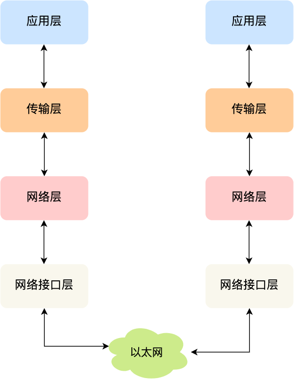
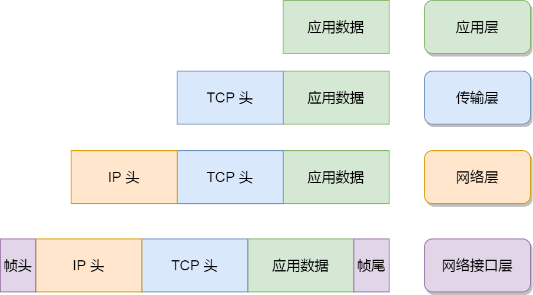
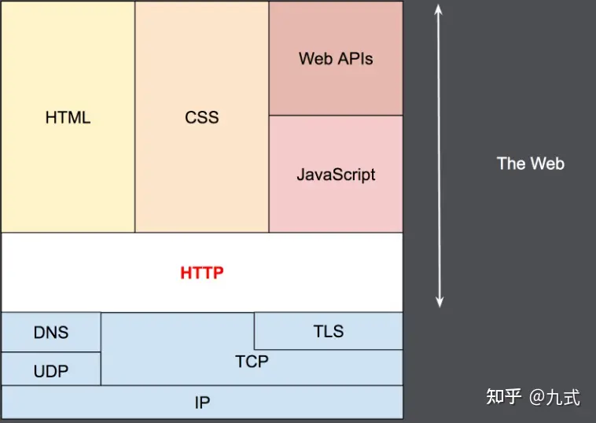
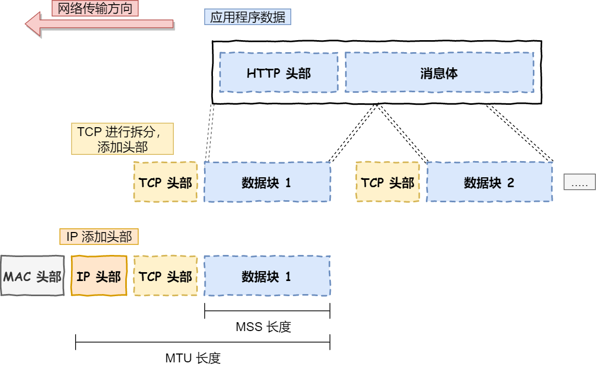
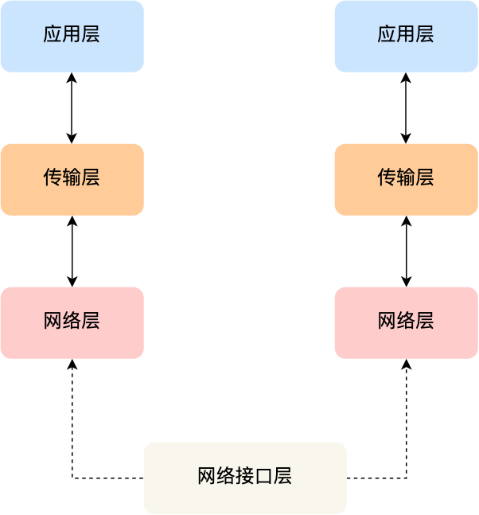
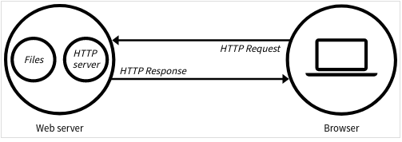
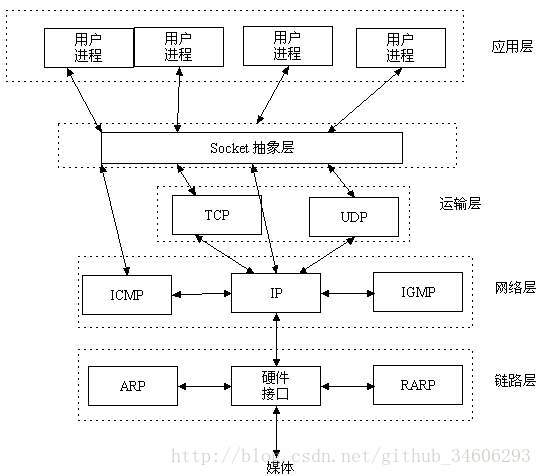
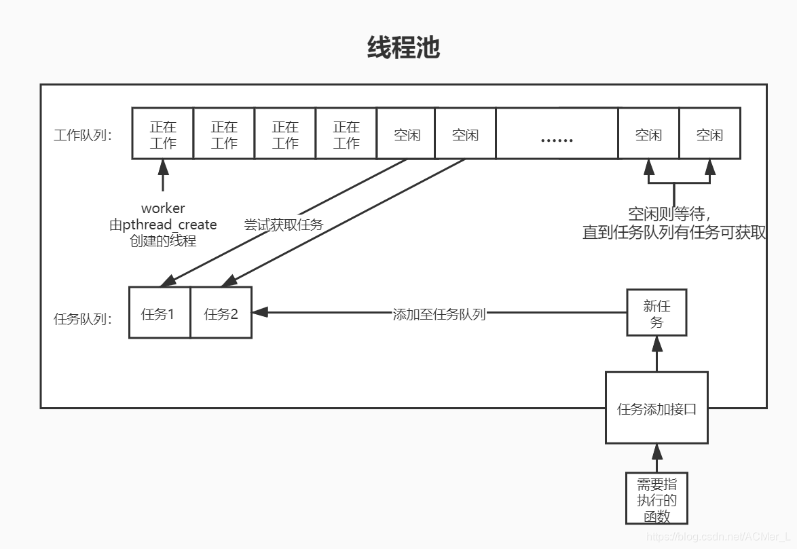
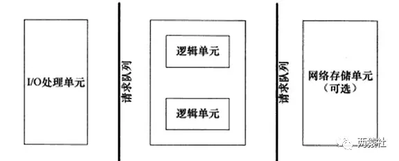

# 开始之前

- 采用Raw_version版本学习
- 4月3开始
- “庖丁解牛”共14篇文章，一天两篇完成，然后回来再细看吧

## 配置`MySQL`

参考：https://blog.csdn.net/yingLGG/article/details/121400284

安装`mysql`

```bash
sudo apt-get install mysql-server
```

进行初始化配置

```bash
sudo mysql_secure_installation
```

具体如何初始化配置，参考：https://zhuanlan.zhihu.com/p/610793026

> 启动server
>
> ./server port
>
> 浏览器端
>
> ip:port

可能还需要安装`apt-get install libmysqlclient-dev`，这个过程可能会遇到错误，根据错误去网上找解决方案即可解决。

然后，实际上是这样的输入：

在terminal中输入`./server 9006`

在浏览器中输入`localhost:9006`

其中，9006可以替换为任意四位数字

就可以啦

## TCP/IP 网络模型

网络模型有：OSI七层参考模型和TCP/IP四层参考模型、五层参考模型。

[TCP/IP 网络模型有哪几层？](https://xiaolincoding.com/network/1_base/tcp_ip_model.html#%E5%BA%94%E7%94%A8%E5%B1%82)

| 层 Layer          | 协议                           | 头部                 | 数据      | 作用 & 特点                                    |
| ----------------- | ------------------------------ | -------------------- | --------- | ---------------------------------------------- |
| 应用层Application | `HTTP`、FTP、Telnet、DNS、SMTP |                      | 消息/报文 | 网络服务与用户的一个接口                       |
| 传输层 Transport  | `TCP`（常用）、UDP             | TCP头部：端口(应用)  | 段        | 为应用层提供网络支持的；不负责在设备间传送数据 |
| 网络层  Internet  | IP 协议                        | IP头部：IP地址(设备) | 包        | 将数据从一个设备传输到另一个设备               |
| 网络接口层Link    |                                | MAC头部              | 帧        | 为网络层提供「链路级别」传输的服务             |





- 网络接口层的传输单位是帧（frame）

- IP 层的传输单位是包（packet）

- TCP 层的传输单位是段（segment）

- HTTP 的传输单位则是消息或报文（message）

但这些名词并没有什么本质的区分，可以统称为数据包。

###应用层

- 应用层是工作在操作系统中的用户态，传输层及以下则工作在内核态。

- 应用层的数据包会传给传输层

#### HTTP协议

[一篇文章搞懂http协议(超详细）](https://zhuanlan.zhihu.com/p/676502895)

Hyper Text Transfer Protocol（超文本传输协议）

- 是用于 从WWW服务器 传输超文本 到 本地浏览器 的传送协议

- 是一个应用层协议，由请求和响应构成，是一个标准的客户端-服务器模型
  - 是 TCP/IP 协议栈中的应用层协议，位于协议栈的最高层

- 是一个无状态的协议
  - 不会在服务器端存储与特定客户端交互有关的信息
  - 每一次请求都是独立的，服务器不记住之前的请求。
  - 客户端识别使用 cookie 或其他机制（如会话 ID）进行。（不太理解cookie，后面再查）

请求和响应：客户端发出的消息为请求`Request`；服务端发出的应答消息位响应`Response`



HTTP 是一种应用层的协议，通过[TCP](https://link.zhihu.com/?target=https%3A//developer.mozilla.org/zh-CN/docs/Glossary/TCP)，或者是[TLS](https://link.zhihu.com/?target=https%3A//developer.mozilla.org/zh-CN/docs/Glossary/TLS)——一种加密过的 TCP 连接——来发送，理论上来说可以借助任何可靠的传输协议。

#### HTTP无状态但有会话

问题：用户没有办法在同一个网站中进行连贯的交互。

方案：利用标头的扩展性，HTTP Cookie  被加进了协议工作流程，每个请求之间可创建会话，让每个请求都能共享相同的上下文信息或相同的状态。

### 传输层

- 传输层数据包>MSS（TCP最大报文段长度）时，要将数据包分块，在TCP中，每个分块位一个`TCP段`（TCP Segment）

  

- 设备作为接收方时，传输层要把数据包传给应用，但是一台设备上可能有多个应用在接受或传输数据，故需要一个编号将应用区分开，这个编号即`端口`。传输层的报文中会携带端口号

- TCP头部用于指定通信的源端端口，目的端口，管理tcp连接等

### 网络层

#### IP 报文

IP 协议会将传输层的报文作为数据部分，再加上 IP 包头组装成 IP 报文， IP 报文大小超过 MTU（以太网中一般为 1500 字节）就会**再次进行分片**，得到一个即将发送到网络的 IP 报文。



#### 寻址

编号：用IP地址给设备编号

- 对于 IPv4 协议， IP 地址共 32 位，分成了四段（比如，192.168.100.1），每段是 8 位。

- 但这样寻址麻烦，因此需要将IP地址分成两种意义

  - 网络号，负责标识该 IP 地址是属于哪个「子网」的；
  - 主机号，负责标识同一「子网」下的不同主机；

- 需要配合子网掩码才能算出 IP 地址 的网络号和主机号

  - 比如 10.100.122.0/24，后面的`/24`表示就是 `255.255.255.0` 子网掩码
  - 255.255.255.0 二进制是「11111111-11111111-11111111-00000000」， 24 个1，为了简化子网掩码的表示，用/24代替255.255.255.0
  - 将 10.100.122.2 和 255.255.255.0 进行**按位与运算**，就可以得到网络号

  

  - 将 255.255.255.0 取反后与IP地址进行进行**按位与运算**，就可以得到主机号。
  - **相当于：掩码=1的位为网络位，掩码=0的位为主机位**

#### 路由

除了寻址能力， IP 协议还有另一个重要的能力就是**路由**。

当数据包到达一个网络节点，就需要通过路由算法决定下一步走哪条路径。路由器寻址工作中，就是要找到目标地址的子网，找到后进而把数据包转发给对应的网络内。

IP 协议的寻址作用是告诉我们去往下一个目的地该朝哪个方向走，路由则是根据「下一个目的地」选择路径。寻址更像在导航，路由更像在操作方向盘

#### TCP/IP和HTTP、TCP、IP

什么是TCP/IP协议？

- TCP/IP协议不仅仅指的是TCP 和IP两个协议
- 而是指一个由FTP、SMTP、TCP、UDP、IP等协议构成的协议簇， 只是因为在TCP/IP协议中TCP协议和IP协议最具代表性，所以被称为TCP/IP协议

TCP/IP和HTTP的关系：

> 我们在传输数据时，可以只使用(传输层)TCP/IP协议，但是那样的话，如果没有应用层，便无法识别数据内容。如果想要使传输的数据有意义，则必须使用到应用层协议。
> WEB使用HTTP协议作应用层协议，以封装HTTP文本信息，然后使用TCP/IP做传输层协议将它发到网络上。

### 网络接口层



**网络接口层**（*Link Layer*）在 IP 头部的前面加上 MAC 头部，并封装成数据帧（Data frame）发送到网络上。

MAC 头部是以太网使用的头部，它包含了接收方和发送方的 MAC 地址等信息，我们可以通过 ARP 协议获取对方的 MAC 地址。

网络接口层主要为网络层提供「链路级别」传输的服务，负责在以太网、WiFi 这样的底层网络上发送原始数据包，工作在网卡这个层次，使用 MAC 地址来标识网络上的设备

##什么是Web Server

[小白视角：一文读懂社长的TinyWebServer(Raw_Version)](https://huixxi.github.io/2020/06/02/%E5%B0%8F%E7%99%BD%E8%A7%86%E8%A7%92%EF%BC%9A%E4%B8%80%E6%96%87%E8%AF%BB%E6%87%82%E7%A4%BE%E9%95%BF%E7%9A%84TinyWebServer/#more)

服务器软件（程序） or 运行这个服务器软件的硬件（计算机）

主要功能：通过HTTP协议与客户端（通常是浏览器Browser）进行通信，来接收、存储、处理，来自客户端的HTTP请求，并对请求作出HTTP响应，返回给客户端其请求的内容（文件、网页等），或Error信息。



## 用户如何与Web服务器通信

1. 在浏览器键入“域名”或“IP地址:端口号”
2. （浏览器先将域名解析成IP地址）
3. 浏览器根据IP地址向对应的Web服务器发送HTTP请求
   1. 通过TCP协议三次握手建立与目标Web服务器的连接
   2. HTTP协议生成针对目标Web服务器的HTTP请求报文
   3. 通过TCP、IP等协议发送到目标Web服务器上

## Socket 是什么

[Socket到底是什么？](https://blog.csdn.net/github_34606293/article/details/78230456)

Socket也称作“套接字

- socket是对TCP/IP协议的封装，它的出现只是使得程序员更方便地使用TCP/IP协议栈而已。

- socket本身并不是协议，它是应用层与TCP/IP协议族通信的中间软件抽象层，是一组调用接口



>TCP/IP只是一个协议栈，就像操作系统的运行机制一样，必须要具体实现，同时还要提供对外的操作接口。 
>这个就像操作系统会提供标准的编程接口，比如win32编程接口一样。 
>**TCP/IP也要提供可供程序员做网络开发所用的接口，这就是Socket编程接口**。

### socket服务器端演示程序

[Linux下的socket演示程序](https://c.biancheng.net/view/2128.html)

```c++
    #include <stdio.h>
    #include <string.h>
    #include <stdlib.h>
    #include <unistd.h>
    #include <arpa/inet.h>
    #include <sys/socket.h>
    #include <netinet/in.h>
    int main(){
        //创建套接字
        int serv_sock = socket(AF_INET, SOCK_STREAM, IPPROTO_TCP);
        //将套接字和IP、端口绑定
        struct sockaddr_in serv_addr;
        memset(&serv_addr, 0, sizeof(serv_addr));  //每个字节都用0填充
        serv_addr.sin_family = AF_INET;  //使用IPv4地址
        serv_addr.sin_addr.s_addr = inet_addr("127.0.0.1");  //具体的IP地址
        serv_addr.sin_port = htons(1234);  //端口
        bind(serv_sock, (struct sockaddr*)&serv_addr, sizeof(serv_addr));
        //进入监听状态，等待用户发起请求
        listen(serv_sock, 20);
        //接收客户端请求
        struct sockaddr_in clnt_addr;
        socklen_t clnt_addr_size = sizeof(clnt_addr);
        int clnt_sock = accept(serv_sock, (struct sockaddr*)&clnt_addr, &clnt_addr_size);
        //向客户端发送数据
        char str[] = "http://c.biancheng.net/socket/";
        write(clnt_sock, str, sizeof(str));
       
        //关闭套接字
        close(clnt_sock);
        close(serv_sock);
        return 0;
    }
```

#### socket()函数

```C++
int serv_sock = socket(AF_INET, SOCK_STREAM, IPPROTO_TCP);
```

- `int socket(int domain, int type, int protocol);`
  - 用于创建一个`socket`描述符（创建套接字），它唯一标识一个`socket`
  - **`socket` 描述符通常是 int 类型**。这是因为 socket 描述符本质上是操作系统分配给进程以标识特定网络连接或端点的整数。
- `domain`，协议域（协议族），决定了`socket`的地址类型，在通信中必须采用对应的地址
  - <u>`AF_INET`：决定了要用  IPv4地址（32位）与端口号（16位）的组合  作为地址</u>
  - `AF_UNIX`：决定了要用一个  绝对路径名  作为地址
- `type`，`socket`类型
  - <u>可靠性： 如果需要确保数据完整性和按序传输，则应使用 `SOCK_STREAM`。</u>
  - 实时性： 如果需要低延迟和无序数据传输，则应使用 `SOCK_DGRAM`。
  - 协议支持： 某些协议（如 TCP）需要特定的 `socket` 类型（`SOCK_STREAM`）。
  - 自定义需求： 对于需要对底层协议进行更精细控制的应用程序，可以使用 `SOCK_RAW` 或 `SOCK_PACKET`。
- `protocol`，制定协议
  - 如`IPPROTO_TCP`、`IPPTOTO_UDP`、`IPPROTO_SCTP`、`IPPROTO_TIPC`等

#### sockaddr_in结构体

```c++
struct sockaddr_in {
	__uint8_t sin_len;
	sa_family_t sin_family;
	in_port_t sin_port;
	struct in_addr sin_addr;
	char sin_zero[8];
};
```

- `sin_family`指代协议族，在`socket`编程中只能是`AF_INET`
- `sin_port`存储端口号（使用网络字节顺序）
- `sin_addr`存储IP地址，使用in_addr这个数据结构
- `sin_zero`是为了让`sockaddr`与`sockaddr_in`两个数据结构保持大小相同而保留的空字节

`sockaddr`和`sockaddr_in`结构体包含的数据都是一样的，它们在使用上有区别

- 程序员不应操作`sockaddr`，`sockaddr`是给操作系统用的。
- 程序员应使用`sockaddr_in`来表示地址，`sockaddr_in`区分了地址和端口，使用更方便。
- 一般用法：程序员把类型、ip地址、端口填充`sockaddr_in`结构体，然后强制转换成`sockaddr`，作为参数传递给系统调用函数

#### bind() 函数

```c++
//将套接字和IP、端口绑定
        struct sockaddr_in serv_addr;
        memset(&serv_addr, 0, sizeof(serv_addr));  //每个字节都用0填充
        serv_addr.sin_family = AF_INET;  //使用IPv4地址
        serv_addr.sin_addr.s_addr = inet_addr("127.0.0.1");  //具体的IP地址
        serv_addr.sin_port = htons(1234);  //端口
        bind(serv_sock, (struct sockaddr*)&serv_addr, sizeof(serv_addr));
```

bind()把用于通信的地址和端口绑定到 socket 上。

`int bind(int sockfd, const struct sockaddr *addr,socklen_t addrlen);`

- `sockfd`，需要绑定的socket
- `addr`，存放服务端用于通信的地址和端口
- `addrlen`，`addr`结构体大小

#### listen()函数

      //进入监听状态，等待用户发起请求
        listen(serv_sock, 20);

没啥好说的

#### accept函数

      //接收客户端请求
        struct sockaddr_in clnt_addr;
        socklen_t clnt_addr_size = sizeof(clnt_addr);
        int clnt_sock = accept(serv_sock, (struct sockaddr*)&clnt_addr, &clnt_addr_size);

`listen`监听客户端来的链接，`accept`将客户端的信息绑定到一个`socket`上，也就是给客户端创建一个`socket`，通过返回值返回给我们客户端的`socket`。

在 `accept()` 函数中，`clnt_addr` 结构体用作输出参数，用于接收客户端的地址信息。当 `accept()` 函数返回时，`clnt_addr` 结构体将包含连接客户端的 IP 地址和端口号。

#### socket和sockaddr_in的区别

- socket 描述符是一个整数，由操作系统分配给进程，以标识特定的网络连接或端点。
- sockaddr_in 是一个数据结构，用于表示 IPv4 地址和端口号。

#### Linux 下 socket 服务器端程序总结：

1. 创建一个 TCP 套接字。
2. 将套接字绑定到指定的 IP 地址和端口。
3. 进入监听状态，等待客户端连接。
4. 接受客户端连接，并创建一个新的套接字来处理该连接。
5. 向客户端发送数据。
6. 关闭客户端套接字和服务器套接字。

### socket客户端演示程序

```C++
#include <stdio.h>
#include <string.h>
#include <stdlib.h>
#include <unistd.h>
#include <arpa/inet.h>
#include <sys/socket.h>
int main(){
    //创建套接字
    int sock = socket(AF_INET, SOCK_STREAM, 0);
    //向服务器（特定的IP和端口）发起请求
    struct sockaddr_in serv_addr;
    memset(&serv_addr, 0, sizeof(serv_addr));  //每个字节都用0填充
    serv_addr.sin_family = AF_INET;  //使用IPv4地址
    serv_addr.sin_addr.s_addr = inet_addr("127.0.0.1");  //具体的IP地址
    serv_addr.sin_port = htons(1234);  //端口
    connect(sock, (struct sockaddr*)&serv_addr, sizeof(serv_addr));

    //读取服务器传回的数据
    char buffer[40];
    read(sock, buffer, sizeof(buffer)-1);

    printf("Message form server: %s\n", buffer);

    //关闭套接字
    close(sock);
    return 0;
}
```

##### connect() 函数

`connect()` 函数用来建立连接。参数和bind相同

##### Linux 下 socket 客户端程序总结：

1. 创建一个 TCP 套接字。
2. 向服务器（特定的 IP 地址和端口）发起连接请求。
3. 连接成功后，从服务器读取数据。
4. 打印服务器发送的数据。
5. 关闭套接字。

#### 服务器和客户端数据传递过程

1. 客户端使用 `connect()` 函数向服务器发起连接请求。
2. 服务器使用 `accept()` 函数接受客户端连接，并创建一个新的套接字来处理该连接。
3. 服务器使用 `write()` 函数向客户端发送数据。
4. 客户端使用 `read()` 函数从服务器读取数据。

当客户端使用 `connect()` 函数向服务器发起连接请求时，如果服务器套接字处于监听状态，它会将该连接请求放入监听队列中。

服务器使用 `accept()` 函数从监听队列中接受客户端连接。如果监听队列中没有待处理的连接请求，`accept()` 函数会阻塞，直到有新的连接请求到达。

#### 重要的头文件

`<sys/socket.h>`： 提供创建和管理套接字的函数，如 `socket()`、`bind()`、`listen()` 和 `accept()`。

`<unistd.h>`： 提供与操作系统交互的函数，如 `read()`、`write()` 和 `close()`。

`<arpa/inet.h>`： 提供与互联网地址和协议相关的函数，如 `inet_addr()`、`inet_ntoa()` 和 `htons()`。


# TinyWebserver 框架


# 线程同步机制封装类

多线程同步，确保任一时刻只能有一个线程能进入关键代码段.

## RAII

RAII全称是“Resource Acquisition is Initialization”，直译过来是“资源获取即初始化”.

RAII的核心思想是将资源或者状态与对象的生命周期绑定，通过C++的语言机制，实现资源和状态的安全管理,智能指针是RAII最好的例子

## 信号量 Semaphore

是一种同步机制，用于协调对共享资源的访问，特别是在多线程或多进程环境中。

是一种特殊的变量，它**只能取自然数值**并且只支持两种操作：等待(P)和信号(V)

假设有信号量SV，对其的P、V操作如下：

- P，如果SV的值大于0，则将其减一；若SV的值为0，则挂起执行

- V，如果有其他进行因为等待SV而挂起，则唤醒；若没有，则将SV值加一

信号量的取值可以是任何自然数，最常用的，最简单的信号量是二进制信号量，只有0和1两个值.

> **原子操作**
>
> 是指一个不可中断的操作，它要么完整地执行，要么根本不执行。这意味着在原子操作执行期间，其他线程或进程无法访问或修改正在操作的数据。
>
> 在多线程或多进程环境中，原子操作非常重要，因为它可以防止数据竞争和不一致性。如果没有原子操作，多个线程或进程可能会同时试图修改共享数据，这可能导致数据损坏或不正确的结果。

## 互斥量 Mutex

互斥锁,也成互斥量,可以保护关键代码段,以确保独占式访问.

当进入关键代码段,获得互斥锁将其加锁

离开关键代码段,唤醒等待该互斥锁的线程.

## 条件变量 Condition Variable

条件变量提供了一种线程间的通知机制,当某个共享数据达到某个值时,唤醒等待这个共享数据的线程.


# 半同步半反应堆线程池

使用一个工作队列完全解除了主线程和工作线程的耦合关系：主线程往工作队列中插入任务，工作线程通过竞争来取得任务并执行它。

## 线程池

[C/C++手撕线程池](https://blog.csdn.net/ACMer_L/article/details/107578636)

### 线程池介绍

在计算机体系结构中有许多池式结构：内存池、数据库连接池、请求池、消息队列、对象池等等。

池式结构解决的主要问题为**缓冲问题**，起到的是缓冲区的作用。

#### 线程池的出现

在程序开始运行阶段提前创建好一堆线程，等我们需要用的时候只要去这一堆线程中领一个线程，用完了再放回去，等程序运行结束时统一释放这一堆线程。按照这个想法，线程池出现了。

#### 线程池解决的问题

| 问题                         | 描述                                                         |
| ---------------------------- | ------------------------------------------------------------ |
| 解决任务处理                 | 线程池可以接受并处理大量的任务，而不会立即创建大量的线程。它通过将任务放入任务队列中，并由**线程池中的线程逐个获取任务来进行处理**。这样可以控制并发线程的数量，避免系统资源过度消耗。 |
| 阻塞 I/O                     | 在进行阻塞 I/O 操作时，线程可以被释放并返回线程池中，而不是一直占用着线程资源。这样可以提高系统的并发性能，因为在 I/O 操作等待完成期间，线程可以被用于处理其他任务。 |
| 解决线程创建与销毁的成本问题 | 创建和销毁线程是一项昂贵的操作，涉及到内存分配、上下文切换等开销。通过使用线程池，可以预先创建一定数量的线程，并在需要时重复使用它们，避免频繁的线程创建和销毁，从而降低系统开销。 |
| 管理线程                     | 线程池可以监控和管理线程的状态、数量和执行情况。它可以动态地调整线程的数量，根据系统负载情况进行扩缩容，确保线程池中的线程数量能够适应当前的工作负载。同时，线程池还可以提供线程的复用和回收机制，确保线程的高效利用。 |

**线程池应用之一：日志存储**

在服务器保存日志至磁盘上时，性能往往压在磁盘读写上，而引入线程池利用**异步解耦**可以解决磁盘读写性能问题。

**线程池的主要作用：异步解耦**

### 线程池中比较关键的东西

若想自己编写一个线程池框架，那么可以先关注线程池中比较关键的东西：

- 工作队列
- 任务队列
- 线程池的池
- `pthread_create`中的回调函数




最佳线程数目 = （（线程等待时间+线程CPU时间）/线程CPU时间 ）* CPU数目

## 服务器编程基本框架

主要由**I/O单元**，逻辑单元和**网络存储单元**组成，其中每个单元之间**通过请求队列进行通信**，从而协同完成任务。

其中I/O单元用于处理客户端连接，读写网络数据；逻辑单元用于处理业务逻辑的线程；网络存储单元指本地数据库和文件等。



## 同步I/O模拟proactor模式

由于异步I/O并不成熟，实际中使用较少，这里将使用同步I/O模拟实现proactor模式。

>同步I/O指内核向应用程序通知的是就绪事件，比如只通知有客户端连接，要求用户代码自行执行I/O操作
>
>proactor模式中，主线程和内核负责处理读写数据、接受新连接等I/O操作，工作线程仅负责业务逻辑，如处理客户请求。通常由**异步I/O**实现。

## Webserver线程池分析

线程池的设计模式为半同步/半反应堆，其中反应堆具体为Proactor事件处理模式。

具体的，主线程为异步线程，负责监听文件描述符，接收socket新连接，若当前监听的socket发生了读写事件，然后将任务插入到请求队列。工作线程从请求队列中取出任务，完成读写数据的处理。


# http连接处理

##  基础知识，http类及请求接收

### epoll

`epoll` 是 Linux 操作系统提供的一种 I/O 复用机制。它是基于事件驱动的模型，用于高效地处理大量的并发 I/O 操作。

`epoll` 的主要作用是监视文件描述符（通常是套接字）上的事件。

使用 `epoll` 需要以下几个步骤：

1. 创建一个 `epoll` 实例，通过调用 `epoll_create` 函数来实现。
2. 使用 `epoll_ctl` 函数向 `epoll` 实例中注册感兴趣的事件，包括读事件、写事件等。
3. 使用 `epoll_wait` 函数等待事件的发生，当有事件发生时，该函数将返回相关的文件描述符和事件信息。
4. 根据返回的文件描述符和事件信息，进行相应的处理操作。

# main函数源码

## 创建数据库连接池和线程池

```C++
   //创建数据库连接池
    connection_pool *connPool = connection_pool::GetInstance();
    connPool->init("localhost", "debian-sys-maint", "uX64R3Nm9aK0TEdB", "yourdb", 3306, 8);

    //创建线程池
    threadpool<http_conn> *pool = NULL;
    try
    {
        pool = new threadpool<http_conn>(connPool);
    }
    catch (...)
    {
        return 1;
    }
```

数据库连接池对象 `connPool` 被作为参数传递给了创建的线程池对象 `pool`。

目的：将数据库连接池与线程池关联起来，使线程池中的线程能够获取数据库连接，并执行相应的任务。

```C++
http_conn *users = new http_conn[MAX_FD];
assert(users);
```

创建了一个 `http_conn` 类型的数组。

`#define MAX_FD 65536 //最大文件描述符`，文件描述符是对文件、套接字和其他I/O资源的引用。它是一个非负整数，由操作系统分配和管理。

`assert(users)` 是一个断言语句。如果users为真，则程序继续执行；为假，则程序会终止并输出相应的错误信息。

**这种架构允许线程池和数据库连接池独立管理。线程池负责处理 HTTP 请求，而数据库连接池负责管理数据库连接。当线程池需要一个数据库连接时，它可以从连接池中获取一个连接，而无需担心连接池的内部工作原理。**

## 初始化数据库读取表

```C++
//初始化数据库读取表
users->initmysql_result(connPool);
```

`initmysql_result`用于初始化 MySQL 连接并从数据库中检索用户名和密码数据。

```C++

void http_conn::initmysql_result(connection_pool *connPool)
{
    //先从连接池中取一个连接
    MYSQL *mysql = NULL;
    connectionRAII mysqlcon(&mysql, connPool);

    //在user表中检索username，passwd数据，浏览器端输入
    if (mysql_query(mysql, "SELECT username,passwd FROM user"))
    {
        LOG_ERROR("SELECT error:%s\n", mysql_error(mysql));
    }

    //从表中检索完整的结果集
    MYSQL_RES *result = mysql_store_result(mysql);

    //返回结果集中的列数
    int num_fields = mysql_num_fields(result);

    //返回所有字段结构的数组
    MYSQL_FIELD *fields = mysql_fetch_fields(result);

    //从结果集中获取下一行，将对应的用户名和密码，存入map中
    while (MYSQL_ROW row = mysql_fetch_row(result))
    {
        string temp1(row[0]);
        string temp2(row[1]);
        users[temp1] = temp2;
    }
}
```

`connectionRAII mysqlcon(&mysql, connPool);`  ，从连接池`connPool`中获取数据库连接，并将连接赋值给变量mysql。

`mysql_query` ，向 `mysql` 数据库发送 SQL 查询语句，从名为 `user`的表中获取 `username`和 `passwd`列的数据

`mysql_store_result`，将查询的结果集存储在`MYSQL_RES`类型的结果对象中

## 创建监听套接字

```C++
int listenfd = socket(PF_INET, SOCK_STREAM, 0);
assert(listenfd >= 0);

int ret = 0;
struct sockaddr_in address;
bzero(&address, sizeof(address));
address.sin_family = AF_INET;
address.sin_addr.s_addr = htonl(INADDR_ANY);
address.sin_port = htons(port);

int flag = 1;
setsockopt(listenfd, SOL_SOCKET, SO_REUSEADDR, &flag, sizeof(flag));

ret = bind(listenfd, (struct sockaddr *)&address, sizeof(address));
assert(ret >= 0);
ret = listen(listenfd, 5);
assert(ret >= 0);
```

1. 创建一个 TCP 套接字。
2. 将套接字绑定到指定的 IP 地址和端口。
3. 进入监听状态，等待客户端连接。
4. ~~接受客户端连接，并创建一个新的套接字来处理该连接。~~
5. ~~向客户端发送数据。~~
6. ~~关闭客户端套接字和服务器套接字。~~

`SO_REUSEADDR`：允许重复使用端口。套接字选项允许在先前被另一个套接字绑定的端口上绑定新的套接字。这对于避免端口耗尽问题很有用

## 创建内核事件表

```C++
//创建内核事件表
    epoll_event events[MAX_EVENT_NUMBER];
    epollfd = epoll_create(5);
    assert(epollfd != -1);

    addfd(epollfd, listenfd, false);
    http_conn::m_epollfd = epollfd;
```

`events`，`epoll` 事件数组，用于存储 `epoll_wait()` 检测到的就绪事件

`epoll_create(5)` 是一个系统调用，用于创建一个 epoll 实例，并返回一个指向该实例的文件描述符。这个文件描述符将被用于所有后续的 epoll 系统调用（如 `epoll_ctl`，`epoll_wait` 等）。**`epollfd`是一个静态全局变量，在前面有定义。**

`addfd`，将监听套接字`listenfd`添加到`epoll`实例，为了让`epoll`实例能够监视和管理它

`http_conn::m_epollfd = epollfd;`，所有的 `http_conn` 实例都将使用同一个 `epoll` 实例来进行 I/O 多路复用，所有的 `HTTP` 连接都可以被同一个 `epoll` 实例管理，这样可以更有效地处理并发连接。

"创建内核事件表"的过程主要涉及到以下几个步骤：

1. `epoll_event events[MAX_EVENT_NUMBER];`：创建一个 `epoll_event` 数组，用于存储 `epoll_wait()` 检测到的就绪事件。`MAX_EVENT_NUMBER` 是数组的大小，也就是最多可以处理的事件数量。

2. `epollfd = epoll_create(5);`：调用 `epoll_create()` 函数创建一个 epoll 实例。这个函数返回一个文件描述符，代表了这个 epoll 实例。这个文件描述符将被用于所有后续的 epoll 系统调用。

3. `addfd(epollfd, listenfd, false);`：调用 `addfd()` 函数将监听套接字 `listenfd` 添加到 epoll 实例。这样，当 `listenfd` 上有新的连接请求时，epoll 就能检测到。

4. `http_conn::m_epollfd = epollfd;`：将 epoll 文件描述符赋值给 `http_conn` 类的静态成员变量 `m_epollfd`。这样，所有的 `http_conn` 对象都可以使用这个 epoll 实例。

"内核事件表"的作用是让你的程序能够**同时监视多个文件描述符**。当任何一个文件描述符就绪（例如，有新的连接请求，或者有数据可读），epoll 就会通知你的程序。这种机制被称为 I/O 多路复用，它可以让你的程序高效地处理大量的并发连接。

## 创建管道

```C++
 //创建管道
    ret = socketpair(PF_UNIX, SOCK_STREAM, 0, pipefd);
    assert(ret != -1);
    setnonblocking(pipefd[1]);
    addfd(epollfd, pipefd[0], false);
```

`socketpair()`函数创建的一对无名的UNIX套接字，`pipefd[0]`和`pipefd[1]`，他们作用是实现进程间的通信，`pipefd[0]`通常用于读取数据，`pipefd[1]`通常用于写入数据。

`setnonblocking()`，将`pipefd[1]`设置为非阻塞模式，对它写入操作不会阻塞。

`addfd()`，将`pipefd[0]`添加到`epollfd`指示的`epoll`事件监听集合中，当`pipefd[0]`上有数据可读时，`epoll`会通知应用程序。

## 设置信号处理函数

```C++
    addsig(SIGALRM, sig_handler, false);
    addsig(SIGTERM, sig_handler, false);
    bool stop_server = false;

    client_data *users_timer = new client_data[MAX_FD];

    bool timeout = false;
    alarm(TIMESLOT);
```

`addsig`，将`SIGALRM`信号和`SIGTERM`信号的处理函数设置为`sig_handler`。`false`参数表示在处理信号时不阻塞其他信号。

`SIGALRM`是一个定时器信号，当定时器到期时，系统会发送这个信号。

`SIGTERM`是一个终止信号，通常用于请求进程正常退出。

`addsig`和`sig_handler`函数前面有定义，先不看了。

`users_timer`，用于存储客户端数据。

`alarm(TIMESLOT)`，设置一个定时器。`TIMESLOT`是定时器的时间。当定时器到期时，系统会发送一个`SIGALRM`信号。

## 服务器接收http请求

浏览器端发出http连接请求，主线程创建http对象接收请求并将所有数据读入对应`buffer`，将该对象插入任务队列，工作线程从任务队列中取出一个任务进行处理。

> **代码总结：**
>
> 这段代码是多线程高并发 Web 服务器的主循环，用于处理客户端请求和定时任务。它使用 epoll 来高效地监视事件。
>
> **关键步骤：**
>
> 1. **主循环：**
>     - 在主循环中，使用 `epoll_wait` 等待事件的发生。
>     - 处理所有就绪事件：
>         - 如果就绪事件是 `listenfd`，则表示有新的客户端连接。
>             - **LT（监听触发）：**接受一个连接并将其添加到用户数组 `users` 中。
>             - **ET（边缘触发）：**循环接收所有待处理的连接，并将其添加到 `users` 数组中。
>         - 如果就绪事件是客户端连接，则表示有数据可读或可写。
>             - 将该连接添加到请求队列中。
>             - 或者，处理从客户端发送的数据。
>         - 处理其他事件，例如异常事件、信号等。
>         - 处理超时定时器事件（使用定时器列表 `timer_lst`）。
>
> 2. **信号处理：**
>     - 处理 `SIGALRM` 信号，表示超时已发生。
>     - 处理 `SIGTERM` 信号，表示服务器应该停止。
>
> 3. **资源释放：**
>     - 在循环结束后，关闭文件描述符、释放内存并删除定时器。
>
> **其他注意事项：**
>
> - `users` 数组用于存储每个客户端连接的信息，包括套接字文件描述符、客户端地址等。
> - `users_timer` 数组用于存储每个客户端连接的定时器信息。
> - `pool` 是一个线程池，用于处理客户请求。
> - `timer_lst` 是一个定时器列表，用于管理超时定时器。
> - `show_error` 函数向客户端发送错误消息。
>
> **作用：**
>
> 这段代码实现了多线程高并发 Web 服务器的核心逻辑。它通过使用 epoll 和定时器列表来高效地处理大量客户端连接和定时任务。

### 主循环

```C++
    while (!stop_server)
    {
        int number = epoll_wait(epollfd, events, MAX_EVENT_NUMBER, -1);
        if (number < 0 && errno != EINTR)
        {
            LOG_ERROR("%s", "epoll failure");
            break;
        }

        for (int i = 0; i < number; i++)
        {
        }
```

`epoll_wait()` 函数监视由 `epollfd` 指定的 epoll 实例中的文件描述符，直到它们准备好进行某些操作，返回就绪文件描述符的数量。

### `for`循环中处理所有就绪事件

```C++
for (int i = 0; i < number; i++){
	int sockfd = events[i].data.fd;
    if (sockfd == listenfd){   
    ...  // 如果是监听套接字，则处理新到的客户连接
    }else if (events[i].events & (EPOLLRDHUP | EPOLLHUP | EPOLLERR)){
    ...  // 如果是错误事件（挂断、连接中断或其他错误）
    }else if ((sockfd == pipefd[0]) && (events[i].events & EPOLLIN)){
    ...  // 如果是从管道中读取数据
    }else if (events[i].events & EPOLLIN){
    ...  // 如果是可以读取数据  
    }else if (events[i].events & EPOLLOUT){
    ...  // 如果可以写入数据 
    }
    ...
}
```

为什么是监听套接字就要处理新的客户端连接？

**监听套接字**用于侦听来自客户端的传入连接请求。当客户端尝试连接到服务器时，监听套接字会接收连接请求并创建一个新的**已连接套接字**来处理该连接。

`sockfd` 等于 `listenfd`，则表示服务器已收到一个新的客户端连接请求。


# 文件之间的关系

```shell
TinyWebServer
├── main.c   
├── CGImysql  #包含与 MySQL 数据库交互的代码
├── http  #包含处理 HTTP 请求和响应的代码
├── lock  #线程同步锁的代码
├── threadpool  #线程池
├── timer  #定时器
├── ...
```


# 同步/异步写日志

对于一个服务器而言，不论是在调试中还是在运行中，都需要通过打日志的方式来记录程序的运行情况。

**同步写日志** ：

意味着在继续执行之前，日志消息将立即写入磁盘或其他持久性存储。这确保了即使系统发生故障，日志消息也不会丢失。

但是，同步写日志可能会降低应用程序的性能，因为在日志消息写入磁盘之前，应用程序必须等待。

**异步写日志** ：

意味着日志消息不会立即写入磁盘，而是存储在内存缓冲区中。应用程序可以继续执行，而日志消息将在后台写入磁盘。

这可以提高应用程序的性能，但如果系统发生故障，可能会丢失存储在缓冲区中的日志消息。


## 文件描述符与套接字（socket）关系

### 套接字 socket 

代表一个通信双方的 link:

网络中运行的两个程序，他们建立起了一个能够使双方互相通信的链接，一个socket就是这个链接的一个末端。一个socket绑定一个端口，这样使得TCP传输层能够知道数据传送的目的地。

一个TCP连接的套接字对（socket pair）是一个定义该连接的两个端点的四元组：本地IP地址、本地TCP端口、外地地址、外地TCP端口。套接字对唯一标识一个网络上的每个TCP连接。

标识每个端口的两个值（IP地址和端口号）通常称为一个套接字。

### 文件描述符 File Descriptor

是操作系统内核为了高效管理已被打开的文件所创建的索引，用于指代被打开的文件

在linux操作系统中，**每一个进程中都有一个文件描述符表**，它是一个指针数组，系统默认初始化了数组的前3位。第0位指向标准的输入流（一般是键盘），第1位指向标准的输出流（一般是显示器），第2位指向标准的错误流（一般是也显示器）。

现在如果有一个进程中只打开了一个 hello.txt 文件,那么这个进程的文件描述符表的第3位就是指向这个 hello.txt 的指针。之后如果该进程创建了一个socket，那么这个文件描述符表的第4位就是指向这个socket的指针，**因为在linux中一切皆文件，socket也是一个文件**。我们所说的文件描述符就是进程中这个数组的下标，因此他也可以说是一个索引。

### 服务器建立连接的过程

首先服务器（server）上有一个socket绑定了80端口（80端口是为HTTP超文本传输协议开放的端口），服务器会一直等待，直到有客户端（client）向服务端发送了连接请求

client会把自己的ip和端口信息告诉server，这样server就会在本地开启一个与client同端口号的端口，并创建一个新的socket，保证80端口的socket能够继续监听其他的连接

这样一对socket就建立完成了，客户端与服务端就能通过socket进行数据的发送和读取了。


# Something new

## 统计代码行数

```shell
find  *.c | xargs wc -l | sort -n
```

## 静态成员变量和函数

### 静态成员变量

将类成员变量声明为static，则为静态成员变量，与一般的成员变量不同，**无论建立多少对象，都只有一个静态成员变量的拷贝，静态成员变量属于一个类，所有对象共享**。

静态变量在编译阶段就分配了空间，对象还没创建时就已经分配了空间，放到全局静态区。

- 静态成员变量

- - 最好是类内声明，类外初始化（以免类名访问静态成员访问不到）。
  - 无论公有，私有，静态成员都可以在类外定义，但私有成员仍有访问权限。
  - 非静态成员类外不能初始化。
  - 静态成员数据是共享的。


### 静态成员函数

将类成员函数声明为static，则为静态成员函数。

- 静态成员函数

- - 静态成员函数可以直接访问静态成员变量，不能直接访问普通成员变量，但可以通过参数传递的方式访问。
  - 普通成员函数可以访问普通成员变量，也可以访问静态成员变量。
  - 静态成员函数没有this指针。非静态数据成员为对象单独维护，但静态成员函数为共享函数，无法区分是哪个对象，因此不能直接访问普通变量成员，也没有this指针。

要访问静态成员函数，可以使用类名和作用域解析运算符`::`来调用该函数。不需要创建类的实例，可以直接通过类名来调用静态成员函数。

```c++
class MyClass {
public:
    static void staticFunction();
};

int main() {
    MyClass::staticFunction();  // 调用静态成员函数
    return 0;
}
```

## C++中try catch语句

```C++
try{
...
}
catch{
...

```

`try`语句块是用来判断是否有异常；

`catch`语句块捕捉异常，并进行处理；

`throw`是抛出异常；


